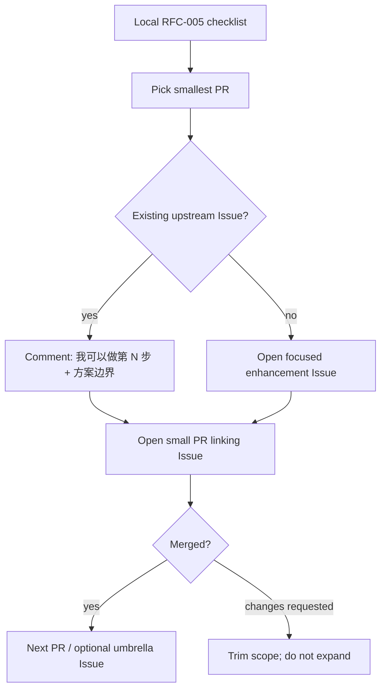

# RFC-005: Upstream contribution plan (fork → LegadoTeam)

Status: draft (local planning)  
Date: 2026-08-11  
Scope: How to land fork product work onto [LegadoTeam/legado](https://github.com/LegadoTeam/legado) in reviewable PRs, what **not** to upstream, and copy that actually persuades maintainers.

Related local RFCs: `rfc-001` (换源 ask order), `rfc-003` (author smart-merge), `rfc-004` (cross-source review).

---

## 1. Verdict (read this first)

| Question | Answer |
|---|---|
| Open a **GitHub Project** on LegadoTeam? | **No (default).** Need maintainer buy-in + `project` scopes; their cadence is Issue → small PR. |
| Track work where? | **Local checklist in this RFC** + optional **one umbrella Issue** on LegadoTeam after first PR lands. Own-fork Project is optional for you only. |
| How many PRs? | **First wave ~8–10** product PRs (not 283 commits; not 1 mega-PR). |
| First pitch? | Prefer **Issue that matches an existing ask**, then a **small PR that closes/partially addresses it**. |

Upstream already has overlapping user asks:

- [#697](https://github.com/LegadoTeam/legado/issues/697) 字数筛选应更细（章节向 / 单章换源钉住当前源）
- [#666](https://github.com/LegadoTeam/legado/issues/666) 批量单章换源自动化接管
- [#664](https://github.com/LegadoTeam/legado/issues/664) 段评增强（部分子项已拆合；其余要协议样例）

Hook PRs to those Issues when the fit is honest. Do **not** invent a parallel “mega roadmap Issue” before any code is reviewable.

---

## 2. Do / don’t upstream

### Do (product, Android-facing)

1. Change-source quality UX (filters, badges, progress strip, wrong-book demotion)
2. Auto-change on info/toc failure (capped, with progress)
3. Empty/佚名 author smart-merge (search + shelf)
4. Cross-source review overlay (RFC-004), **phased** to match upstream’s “协议先于大 UI” preference seen on #664

### Don’t (keep on fork)

- MCP / Cursor 修书源通道
- `source-cli` / dig / hunt / shelf-stale scripts & docs
- Fork-only CI (`SyncUpstream.yml` and friends)
- Device acceptance screenshot dumps, Harness-only tests that need your phone farm

---

## 3. Project vs Issue vs PR



| Tool | Use? | Why |
|---|---|---|
| LegadoTeam **Project board** | **Not yet** | Needs org permission; maintainers already drive via Issues/PRs. Opening one unsolicited looks like process dump. |
| **Umbrella Issue** on LegadoTeam | **After 1–2 merges** | One tracker linking remaining PRs is enough; title like「换源质量与过滤：分步合入」. |
| **Project on `h11128/legado`** | Optional | Fine for your own WIP columns; do not require upstream to look at it. |
| **Discussion / 群** | Only if they already use it | Prefer public Issue comments so review history is searchable. |

---

## 4. PR sequence (first wave)

Order = **trust → value → size**. Each PR: rebase on latest `LegadoTeam/legado` `master`, Chinese title, tests when behavior is non-obvious.

| Order | PR theme | Hook | Approx size | Notes |
|---|---|---|---|---|
| 1 | 换源过滤菜单（作者/字数等）+ 不误触发重搜 | Soft-hook #697 | M | Easiest story: “用户可控，默认可关” |
| 2 | 换源双行进度 / early-stop 有用计数 | — | S–M | Pure UX; screenshot in PR |
| 3 | 错书降权 + TOC/最新章徽章 | — | M | Explain false-positive risk + how to turn soft |
| 4 | 排除专用段评源出换源列表 | — | S | Tiny; good “second merge” |
| 5 | 空作者 / 佚名 smart-merge | — | M | Cite local RFC-003 intent in PR body |
| 6 | 失败自动换源（详情/目录）+ 上限 + 进度 | — | M–L | Product-sensitive; ship behind clear prefs |
| 7 | 段评：绑定基础 / overlay 最小切片 | Partial #664 only if honest | M | Upstream said protocol samples matter—start narrow |
| 8+ | RFC-004 后续 phase | #664 / new Issues | — | One phase per PR |

**Batch chapter auto-pilot (#666):** treat as a **later** PR. Upstream just landed manual batch cache (#659). Auto-range “按键精灵” is a bigger product leap—discuss on #666 before coding a PR.

Skip opening all Issues at once. Open Issue+PR for #1 first; use maintainer reaction to pace the rest.

---

## 5. Persuasion copy (templates)

Tone: **场景 → 现状痛点 → 最小改动 → 默认安全 → 验证**. Match their Issue form. Avoid fork jargon (MCP、dig、Harness、RFC 编号可放「补充」不要当标题).

### 5.1 Comment on an existing Issue (before PR)

```text
我这边 fork 里已经有一版可运行的实现，想按「小步 PR」往上游合，先征求一下方向。

针对本 Issue，我建议第一刀只做：
- <一句话范围>
- 默认：<关闭 / 不影响现有路径>
- 不做：<明确砍掉的范围，避免一次塞太多>

验证：
- 单元测试：<有/无>
- 真机：<换源场景一句话>

如果这个边界 OK，我开 PR 链到本 Issue。
```

### 5.2 New enhancement Issue (when no hook)

Use LegadoTeam’s template fields. Title examples:

- `换源结果支持可选过滤（作者/字数等），默认不改变现有行为`
- `书名相同且作者为空/佚名时合并搜索与书架条目`

Body skeleton:

```markdown
### 使用场景
1. …
2. …

### 建议方案
- …
- 默认关闭或保持现状行为：…

### 可选方案
- 更大的自动换源 / 段评 overlay 另开 Issue，不塞进本 PR

### 补充材料
- 截图 / 录屏
- （可选）实现已在 fork 验证：链接到 commit 即可，不要贴整仓 diff
```

### 5.3 PR title + body

Titles like upstream: short Chinese, one change (`允许…` / `修复…` / `支持…`).

```markdown
## 摘要
- 解决：…
- 非目标：…

## 行为变化
- 默认：…
- 打开设置后：…

## 测试
- [ ] 单元测试 …
- [ ] 真机：换源 / 搜索 / 段评 …

Closes #<issue>   <!-- or: Partial #<issue> -->
```

### 5.4 One-liner “why merge” (for description / comment)

Use **one** of these, not a laundry list:

1. **换源过滤：**「书源噪声大时用户能自己收窄结果，默认关闭，不改变现有搜索。」
2. **进度条：**「长换源时能看见有效命中而不是空白转圈。」
3. **错书降权：**「目录/最新章对不上的源往下沉，减少点进假书。」
4. **作者 merge：**「同一书名作者空/佚名不再刷一屏重复卡片。」
5. **自动换源：**「详情/目录加载失败时有上限地尝试可用源，带进度，可关。」

---

## 6. What actually persuades this repo

Observed maintainer pattern (2026-08): small Kotlin PRs, Chinese titles, tests on non-trivial fixes, Issues stay open when protocol is unclear (#664 comment).

| Do | Don’t |
|---|---|
| Ship the smallest vertical slice | Paste “我们 fork 的 10 个 RFC 路线图” |
| Default-safe / pref-gated | Force new ranking on everyone |
| Link one Issue | Open Project + 12 Issues + 12 PRs day one |
| Rebase on latest master (they move fast) | PR against stale fork sync |
| Accept “拆小 / 先要样例” | Argue architecture in the first PR |

---

## 7. Local checklist

- [ ] Confirm PR1 scope (过滤菜单) still clean on top of latest upstream
- [ ] Write Issue comment or new Issue with §5.1 / §5.2
- [ ] Open PR1; wait for review signal before PR2
- [ ] After 1–2 merges: optional umbrella Issue listing remaining table rows
- [ ] Revisit #666 only after discussing auto-batch product boundaries
- [ ] Never upstream MCP / repair CLI in the same wave

---

## 8. Out of scope for this RFC

Implementation work, branch naming, or opening the first upstream PR. This file is the **plan + copy kit** only.
