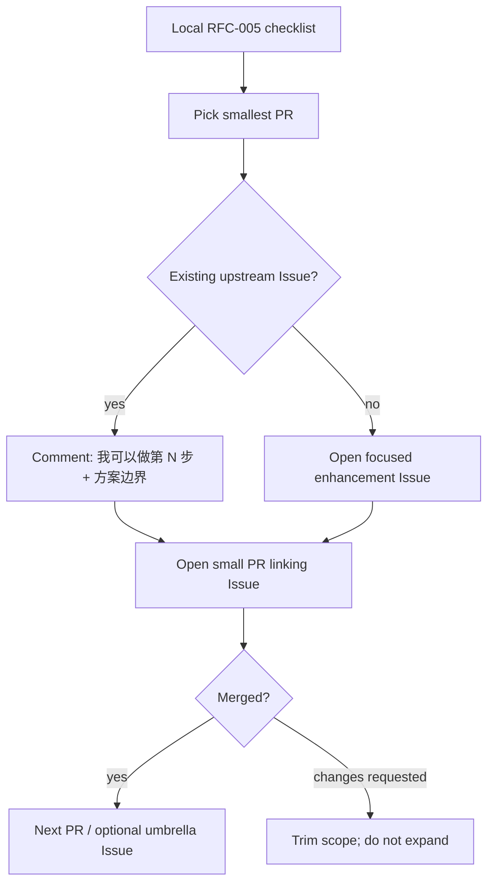
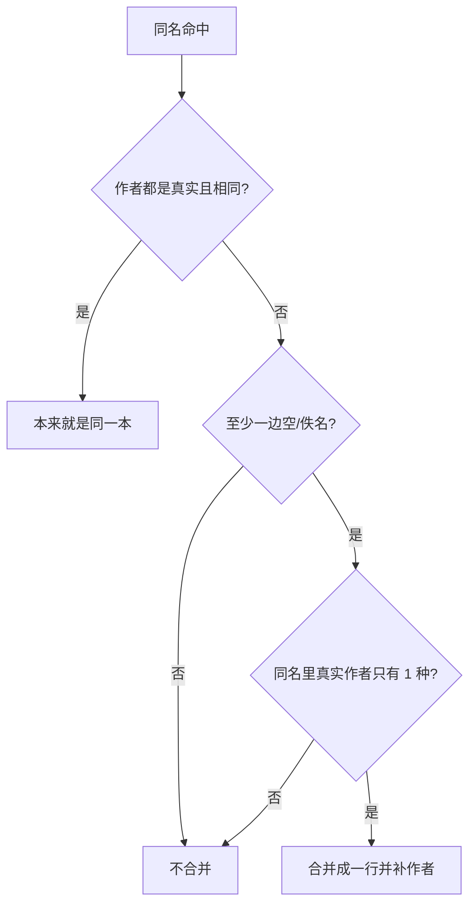
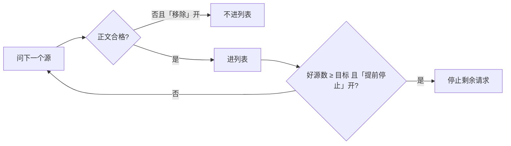
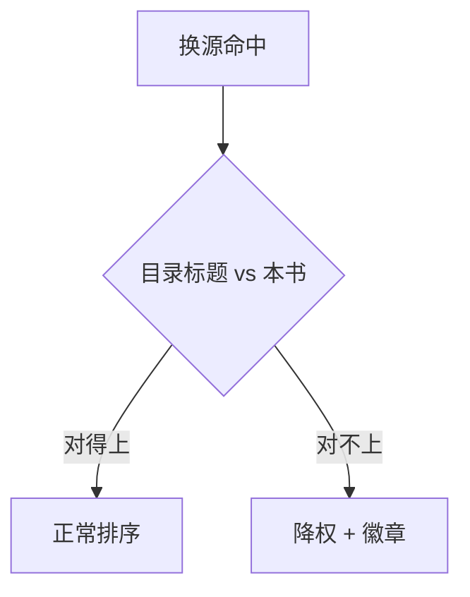
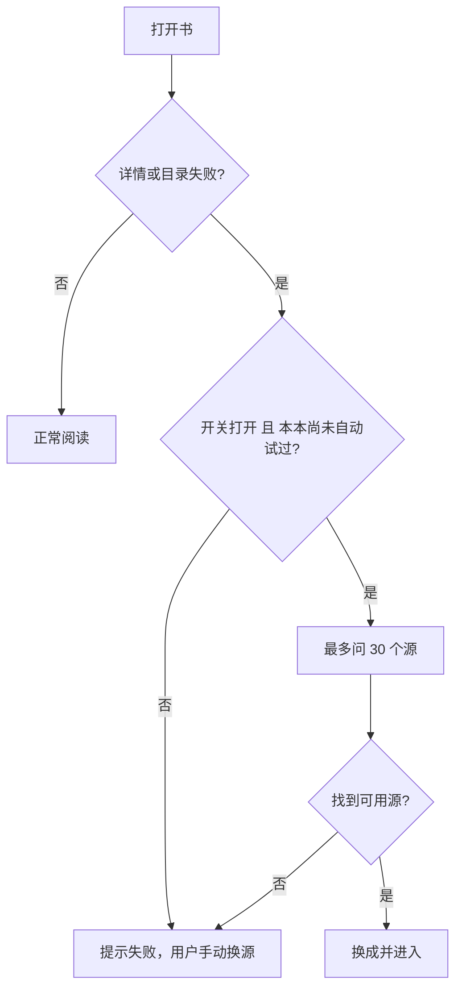
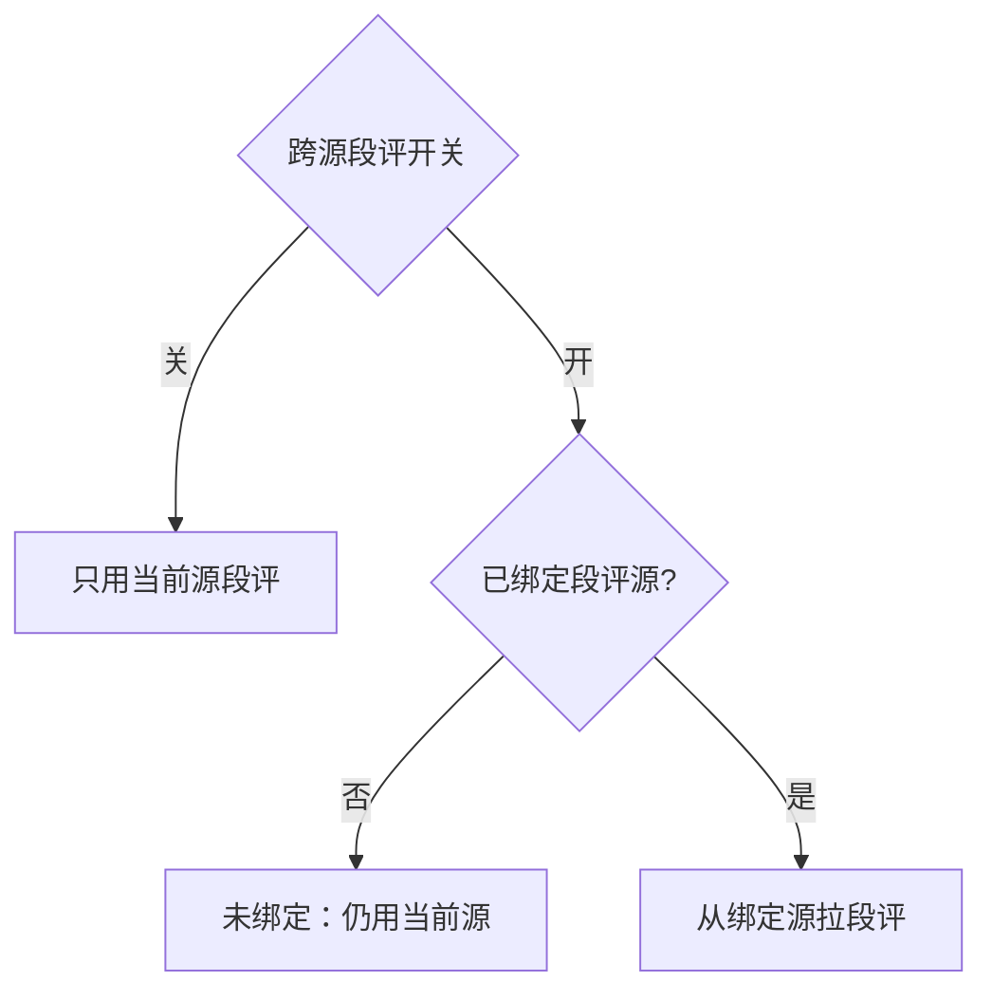
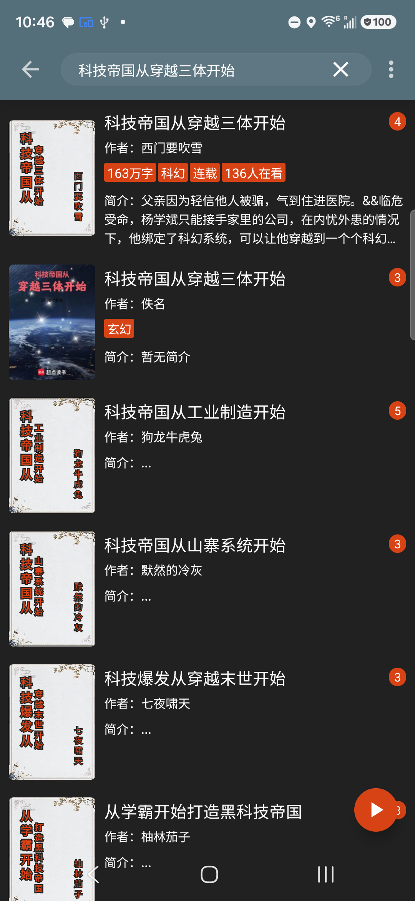
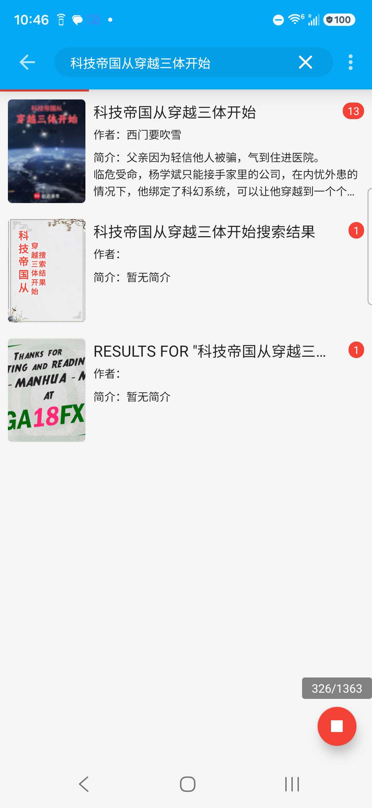

# RFC-005: Upstream contribution plan (fork → LegadoTeam)

Status: draft (local planning, corrected 2026-08-12 against upstream)
Date: 2026-08-11
Scope: How to land fork product work onto [LegadoTeam/legado](https://github.com/LegadoTeam/legado) in reviewable PRs, what **not** to upstream, and copy that actually persuades maintainers.

Related local RFCs: `rfc-001` (换源 ask order), `rfc-003` (author smart-merge), `rfc-004` (cross-source review).

---

## 1. Verdict (read this first)

| Question | Answer |
|---|---|
| Open a **GitHub Project** on LegadoTeam? | **No (default).** Need maintainer buy-in + `project` scopes; their cadence is Issue → small PR. |
| Track work where? | **Local checklist in this RFC** + optional **one umbrella Issue** on LegadoTeam after first PR lands. Own-fork Project is optional for you only. |
| How many PRs? | **First wave ~7** product PRs (not 283 commits; not 1 mega-PR). |
| First pitch? | Prefer **Issue that matches an existing ask**, then a **small PR that closes/partially addresses it**. |

Upstream already has overlapping user asks:

- [#697](https://github.com/LegadoTeam/legado/issues/697) 字数筛选应更细（章节向 / 单章换源钉住当前源）— upstream **already has** the toggle; this Issue wants finer behavior.
- [#666](https://github.com/LegadoTeam/legado/issues/666) 批量单章换源自动化接管 — discuss boundary before coding.
- [#664](https://github.com/LegadoTeam/legado/issues/664) 段评增强（部分子项已拆合；其余要协议样例）.

Hook PRs to those Issues when the fit is honest. Do **not** invent a parallel "mega roadmap Issue" before any code is reviewable.

---

## 2. Do / don't upstream

### Do (product, Android-facing)

1. Author smart-merge (empty/佚名 on search + shelf) — most independent.
2. Change-source quality toggles (filter non-novel, filter non-book-intro, drop content bad, early stop).
3. Change-source progress strip upgrade + wrong-book demotion + badges.
4. Auto-change on info/toc failure (capped, with progress).
5. Cross-source review overlay (RFC-004), **phased** to match upstream's "协议先于大 UI" preference seen on #664.

### Don't (keep on fork)

- MCP / Cursor 修书源通道
- `source-cli` / dig / hunt / shelf-stale scripts & docs
- Fork-only CI (`SyncUpstream.yml` and friends)
- Device acceptance screenshot dumps, Harness-only tests that need your phone farm

---

## 3. Project vs Issue vs PR



| Tool | Use? | Why |
|---|---|---|
| LegadoTeam **Project board** | **Not yet** | Needs org permission; maintainers already drive via Issues/PRs. Opening one unsolicited looks like process dump. |
| **Umbrella Issue** on LegadoTeam | **After 1–2 merges** | One tracker linking remaining PRs is enough; title like「换源质量与过滤：分步合入」. |
| **Project on `h11128/legado`** | Optional | Fine for your own WIP columns; do not require upstream to look at it. |
| **Discussion / 群** | Only if they already use it | Prefer public Issue comments so review history is searchable. |

---

## 4. PR sequence (first wave)

### 4.0 What upstream already has — do NOT re-pitch

Verified against `upstream/master` 2026-08-11. These exist upstream; fork does NOT add them:

| Feature | Upstream menu / commit | Note |
|---|---|---|
| 作者校验 toggle | `menu_check_author` | — |
| 加载字数 toggle | `menu_load_word_count` | — |
| **字数过滤 toggle（带 off/绝对/相对、min/max UI）** | `menu_word_count_filter` + full strings | Fork does NOT add. #697 asks for *finer* (per-chapter), not the toggle itself. |
| **按响应时间排序 toggle** | `menu_sort_respond_time` | Fork does NOT add. |
| 加载详情 / 加载目录 toggle | `menu_load_info` / `menu_load_toc` | — |
| 换源弹窗生命周期（PendingEvent） | #674 | Already merged this sync. |
| 批量单章换源缓存 | #659 | Already merged this sync. |
| JS 段评回复分页 | `020ddffa9` | Already merged this sync. |

**Implication:** PR1 is NOT "字数过滤 toggle" — upstream has it. PR1 is the most independent fork-only delta.

### 4.1 Fork-only delta (real contribution surface)

| Group | What | New files | Needs checkalgo? |
|---|---|---|---|
| **C. 作者 smart-merge** | 空/佚名作者合并（搜索 + 书架） | `BookAuthorIdentity.kt`, `SearchBookMerge.kt`, SearchViewModel/Shelf wiring | No — most independent |
| **A1. 非小说/非书籍简介过滤** | 2 toggle：`menu_filter_non_novel`, `menu_filter_non_book_intro` | menu xml, ViewModel, quality host/intro filters | Light |
| **A2. 内容差丢弃 + 提前停止** | 2 toggle：`menu_drop_content_bad`, `menu_early_stop` | `ChangeBookSourceQuality.kt`, `CheckAimdLimiter.kt`, `CheckHostEwma.kt` subset | **Yes — brings quality scorer** |
| **A3. 换源进度条升级** | 双行 metrics、early-stop 状态文案 | `ChangeSourceProgressFormat.kt`, `ChangeSourceProgressUi.kt` | On A2 events |
| **A4. 错书降权 + 徽章** | TOC 标题身份降权、TOC/最新章软元徽章 | `ChangeChapterVerify.kt` subset, Adapter badges | Yes |
| **B. 自动换源** | 详情/目录失败自动换源、上限 30、进度 | `AutoChangeSource.kt`, `AutoChangeProgress*.kt`, ReadBook/Info wiring | Yes + behavior change |
| **D. 段评 overlay (RFC-004)** | 跨源段评绑定 / overlay / auto-bind / merge | 12 files in `model/review/`, `ReviewMergeDetailDialog.kt`, 4 prefs | Phased, aligns #664 |

**Checkalgo 引擎**（22 files in `model/checkalgo/`）是 A2/A3/A4/B 的地基。**不要单独开"引擎" PR**——上游不会收一个没有用户可见功能的 22 文件引擎。每个 PR 只带它需要的那几块。

### 4.2 Corrected PR order

Order = **independence → default-safety → dependency depth**. Rebase on latest `LegadoTeam/legado` `master`, Chinese title, tests when behavior is non-obvious.

| # | PR | Group | Hook | Size | Why this position |
|---|---|---|---|---|---|
| 1 | 空/佚名作者 smart-merge（搜索 + 书架） | C | New Issue | M | **Most independent** — no checkalgo, default-safe (only merges when author empty/佚名), clear story. Best trust builder. |
| 2 | 过滤非小说 + 非书籍简介 toggle | A1 | New Issue | M | 2 toggles, default-off, light dependency. Builds on PR1 trust. |
| 3 | 内容差丢弃 + 提前停止 toggle | A2 | New Issue | M–L | **Brings quality scorer** (`ChangeBookSourceQuality` + minimal checkalgo). First PR carrying engine code; needs false-positive defense. |
| 4 | 换源进度条升级（双行 metrics + early-stop 状态） | A3 | — | S–M | Pure UX on PR3 events. Screenshot sells. Breathable after heavy PR3. |
| 5 | 错书降权 + TOC/最新章徽章 | A4 | — | M | First ranking change. Needs PR3 quality + PR1 trust. Default soft / pref-gated. |
| 6 | 失败自动换源（上限 30 + 进度 + 可关） | B | — | M–L | **Biggest behavior change** (App 主动换). After PR3/PR5 accepted. Pref-gated, default-off. |
| 7+ | 段评 overlay RFC-004 分 phase | D | #664 partial | M each | Upstream said protocol samples first (#664 comment). One phase per PR. |

**Not in this wave:**
- **#666 批量换章自动化（按键精灵）**: upstream just 合 #659 手动批量. Auto-range 是更大跃迁 — **先在 #666 讨论边界，再写代码**。
- **MCP / source-cli / dig / hunt / 修书源脚本**: 永远不进这批。

### 4.3 Why this order (one line each)

1. **PR1 作者 merge**: 不靠 checkalgo，最独立，故事最清楚（"同名空作者不再刷屏"）。
2. **PR2 非小说过滤**: 2 个 toggle，默认关，依赖浅（类型嗅探）。
3. **PR3 内容差+提前停止**: 第一次带 checkalgo 质量评分，必须给假阳性样例。
4. **PR4 进度条**: 纯 UX，截图卖，是 PR3 之后的轻 PR。
5. **PR5 错书降权**: 第一次动排序，靠 PR1 信任 + PR3 质量。
6. **PR6 自动换源**: 最大行为变化，App 主动换，必须最后碰。
7. **PR7+ 段评**: 跟上游 #664 节奏，一 phase 一 PR。

Skip opening all Issues at once. Open Issue+PR for #1 first; use maintainer reaction to pace the rest.

---

## 5. Persuasion copy (templates)

Tone: **场景 → 现状痛点 → 最小改动 → 默认安全 → 验证**. Match their Issue form. Avoid fork jargon (MCP、dig、Harness、RFC 编号可放「补充」不要当标题).

### 5.1 Comment on an existing Issue (before PR)

```text
我这边 fork 里已经有一版可运行的实现，想按「小步 PR」往上游合，先征求一下方向。

针对本 Issue，我建议第一刀只做：
- <一句话范围>
- 默认：<关闭 / 不影响现有路径>
- 不做：<明确砍掉的范围，避免一次塞太多>

验证：
- 单元测试：<有/无>
- 真机：<换源场景一句话>

如果这个边界 OK，我开 PR 链到本 Issue。
```

### 5.2 New enhancement Issue (when no hook)

Use LegadoTeam's template fields. Title examples:

- `书名相同且作者为空/佚名时合并搜索与书架条目`
- `换源结果支持过滤非小说源与非书籍简介源`

Body skeleton:

```markdown
### 使用场景
1. …
2. …

### 建议方案
- …
- 默认关闭或保持现状行为：…

### 可选方案
- 更大的自动换源 / 段评 overlay 另开 Issue，不塞进本 PR

### 补充材料
- 截图 / 录屏
- （可选）实现已在 fork 验证：链接到 commit 即可，不要贴整仓 diff
```

### 5.3 PR title + body

Titles like upstream: short Chinese, one change (`允许…` / `修复…` / `支持…`).

Upstream skeleton is [`.github/pull_request_template.md`](https://github.com/LegadoTeam/legado/blob/master/.github/pull_request_template.md): **变更说明**（问题 / 原因 / 做法）→ 勾选类型 / 平台 / 模块 / 影响 → **验证**.

本仓库额外要求：在「验证」之前保留 **示意图** 和 **行为变化**。变更说明用中文写清 **是什么 / 为什么 / 怎么做**。没图的 PR 会被略过。

```markdown
## 变更说明

**是什么：** …
**为什么：** …
**怎么做：** …

关联 Issue：暂无（新功能）  <!-- 或 Fixes #N / Partial #N -->

## 变更类型

- [ ] Bug 修复
- [ ] 新功能
- [ ] 文档
- [ ] 构建或依赖
- [ ] 重构或维护

## 涉及平台

- [x] Android
- [ ] Web
- [ ] Android 与 Web

## 涉及模块

- [ ] 阅读文本与翻页
- [ ] 漫画阅读
- [ ] 朗读与音频
- [ ] 书架与书籍管理
- [ ] 书源与规则解析
- [ ] Web 服务与前端
- [ ] 备份、同步与数据
- [ ] 构建、安装与更新
- [ ] 其他或不确定

## 影响类型

- [ ] 崩溃或无响应
- [ ] 数据丢失或损坏
- [ ] 性能或耗电
- [ ] 兼容性
- [ ] 界面或交互
- [ ] 功能结果错误
- [ ] 无用户可见影响

## 示意图

<!-- before/after 或菜单截图，见 §5.5；§9 有现成对照表 -->

## 行为变化

- 默认：…
- 打开设置后：…

## 验证

- [ ] 已完成与改动范围相符的验证
- [ ] 未引入无关改动
- 单元测试：…
- 真机：…
```

### 5.4 One-liner "why merge" (per PR)

Use **one** of these, not a laundry list:

1. **作者 merge（PR1）：**「同一书名作者空/佚名不再刷一屏重复卡片，只在作者字段确实为空时合并。」
2. **非小说过滤（PR2）：**「书源噪声大时用户能过滤掉非小说源和字典简介源，默认关闭，不改变现有搜索。」
3. **内容差+提前停止（PR3）：**「内容差源可一键丢弃，够了好源就停，减少无效等待。」
4. **进度条（PR4）：**「长换源时能看见有效命中和停止进度，而不是空白转圈。」
5. **错书降权（PR5）：**「目录/最新章对不上的源往下沉，减少点进假书。」
6. **自动换源（PR6）：**「详情/目录加载失败时有上限地尝试可用源，带进度，可关。」
7. **段评 overlay（PR7+）：**「跨源段评绑定与合并，按 phase 合入，先协议后 UI。」

### 5.5 示意图选型（每个 PR 必须有）

**原则：维护者看图 10 秒决定要不要读正文。** 没图 = 没人审。

| 类型 | 何时用 | 怎么做 |
|---|---|---|
| **Before/After 截图** | 列表 / 卡片 / 排序变化 | 两张手机截图并排，红框标差异 |
| **录屏 GIF** | 动画 / 进度 / 自动行为 | 录 5–10s，转 GIF，<2MB |
| **菜单截图** | 新 toggle / 设置项 | 展开菜单的截图 + 箭头指新项 |
| **Mermaid 流程** | 协议 / 状态机 / 触发条件 | 只在截图说不清时用（如段评绑定 phase） |

**截图要求：**
1. 真机截，不要模拟器
2. 中文界面（上游是中文项目）
3. 红框 / 箭头标变化点，别让审查者找
4. 文件名 `prN-before.png` / `prN-after.png`，放 PR 描述里
5. GIF 用 `prN-demo.gif`

**每个 PR 的完整说明、流程、界面示意见 §9。** 真机证据（不要每个 PR 都拍 before/after）：

| # | 讲什么 | 真机文件 |
|---|---|---|
| 1a | 空/佚名 **合并成功**（唯一真实作者） | `pr1-happy-before.png` / `pr1-happy-after.png` |
| 1b | 空/佚名 **不猜**（多种真实作者） | `pr1-before.png` / `pr1-after.png` |
| 2 | 换源菜单新开关 vs 上游已有 | `pr2-menu.png` |
| 3 | 换源进行中（双行进度 + 徽章） | `pr2-after.png` |

其余 PR 开 PR 时复用这几组 + §9 示意图即可。 PR1 必须同时给 1a 和 1b，只贴「天才之上」会被看成没合并。

**不要做的：**
- 不要贴整页长截图，裁到变化区域
- 不要贴 fork 专属的调试 / MCP / dig 截图
- 不要用英文界面截图
- 不要只放文字描述「效果是…」而不给图

---

## 6. What actually persuades this repo

Observed maintainer pattern (2026-08): small Kotlin PRs, Chinese titles, tests on non-trivial fixes, Issues stay open when protocol is unclear (#664 comment).

| Do | Don't |
|---|---|
| Ship the smallest vertical slice | Paste "我们 fork 的 10 个 RFC 路线图" |
| Default-safe / pref-gated | Force new ranking on everyone |
| **Include 示意图 in every PR** | Text-only PR description |
| Link one Issue | Open Project + 12 Issues + 12 PRs day one |
| Rebase on latest master (they move fast) | PR against stale fork sync |
| Accept "拆小 / 先要样例" | Argue architecture in the first PR |
| Verify upstream already has it before pitching | Re-pitch 字数过滤 / 响应时间排序 (they exist) |

---

## 7. Local checklist

- [ ] Confirm PR1 scope (作者 smart-merge) still clean on top of latest upstream
- [ ] Write new Issue with §5.2 (no existing hook for author merge)
- [ ] Device shots: `python scripts/rfc005-pr-screenshot-session.py` → `docs/design/rfc-005-assets/` (§10)
- [ ] Open PR1: paste §5.3 template + §9 PR1 变更说明/示意图/行为变化/验证；wait for review before PR2
- [ ] After 1–2 merges: optional umbrella Issue listing remaining table rows
- [ ] Revisit #666 only after discussing auto-batch product boundaries
- [ ] Never upstream MCP / repair CLI in the same wave
- [ ] Before each PR: re-verify upstream didn't just add the same toggle/feature

---

## 8. Out of scope for this RFC

Implementation work, branch naming, or opening the first upstream PR. Ready-to-paste copy and diagrams live in §9; **真机截图 / GIF 仍在开 PR 前按 §5.5 补**，本节示意图只负责让审查者先看懂 feature。

---

## 9. Per-PR briefing pack（开 PR 时直接贴）

贴 GitHub 时：先套 §5.3 的上游模板勾选（类型 / 平台 / 模块 / 影响），再把下面 **变更说明 / 示意图 / 行为变化 / 验证** 填进去。真机图用 §5.5 / §10 文件名。

### PR1 — 空/佚名作者 smart-merge

**建议标题：** `支持书名相同且作者为空/佚名时合并搜索与书架条目`

勾选：新功能 · Android · 书架与书籍管理 · 界面或交互

```markdown
## 变更说明

**是什么：** 搜索和书架现在会把「书名相同、作者为空/佚名」的重复条目收成一本，并补上那个唯一的真实作者。

**为什么：** 认书靠「书名 + 作者」。很多书源把作者写成空、`佚名`、`未知`，应用会当成另一本书，同一本刷出一排卡片。这是身份规则把占位作者当成了真作者。

**怎么做：** 空/佚名/未知等视为「没有作者」。只在下面同时成立时合并：

1. 书名去空格后相同
2. 至少一边是空或占位作者
3. 同名命中里真实作者**只有一种** → 合成一行，补上那个作者，来源叠在一起
4. 真实作者 ≥2 种 → **不猜**，继续分开

书架同样合并重复行。不删本地书；若填作者会和已有 `(书名, 真实作者)` 撞库，则不硬改。

关联 Issue：暂无（新功能）
```

**示意图：** 必须同时给合并成功和不猜。不要只用「天才之上」（那是反例）。

- 合并成功：`pr1-happy-before.png` / `pr1-happy-after.png`（搜「科技帝国从穿越三体开始」：佚名并进西门要吹雪，来源 4 → 13）
- 不猜：`pr1-before.png` / `pr1-after.png`（搜「天才之上」：多种真实作者，佚名仍单独一行）



**行为变化：**

- 默认：始终按上述规则合并，没有「关」开关。不满足条件时行为和现在一样。
- 搜索列表按原始命中重建展示，避免先并错再粘住。
- 书架合并走自定义封面保护，不覆盖用户封面。
- 不删本地书；不把网页佚名书硬并进本地书。
- 非目标：不同书同名不同作者的合并；改书源 HTML；MCP / 校验引擎。

**验证：** 单元测试 `SearchBookMergeTest` + `SearchBookShelfHelpTest`；真机上述两本书名。

---

### PR2 — 过滤非小说源 + 词典简介

**建议标题：** `换源菜单增加过滤非小说源与词典简介`

勾选：新功能 · Android · 书架与书籍管理 · 界面或交互

```markdown
## 变更说明

**是什么：** 换源菜单增加两个默认关闭的开关：过滤非小说源、过滤词典简介。

**为什么：** 换源列表常混进漫画站、影视站、词典/百科简介页，看起来像书、点进去不是小说。上游已有作者校验、加载字数、字数过滤、按响应时间排序——本 PR 不再重复那些。

**怎么做：**

- `过滤非小说源`：按书源类型/主机规则丢掉明显不是小说的源
- `过滤词典简介`：丢掉只有词典/百科简介、没有正文目录的命中
- 过滤后若列表被掏空，回退到未过滤列表

关联 Issue：暂无（新功能）
```

**示意图：** 复用 `pr2-menu.png`。

```
换源 · 菜单（仅标新项）
  校验作者              ← 上游已有
▶ 过滤非小说源          ← NEW
▶ 过滤词典简介          ← NEW
  加载字数 / 按响应时间排序 / 字数过滤  ← 上游已有
```

**行为变化：**

- 默认：两个 toggle 关闭 = 和现在一模一样。
- 打开后：词典/影视行从换源列表消失；若筛空则回退。
- 非目标：改排序；字数过滤；错书降权（PR5）；checkalgo 全量引擎。

**验证：** 关=与现在相同；开=非小说/词典行消失且不把列表掏空。

---

### PR3 — 正文不合格移除 + 足够好源后提前停止

**建议标题：** `换源支持丢弃不合格正文，并在足够好源后提前停止`

勾选：新功能 · Android · 书架与书籍管理 · 界面或交互

```markdown
## 变更说明

**是什么：** 换源增加两个默认关闭的开关：正文不合格时移除、足够好源后提前停止。

**为什么：** 长换源会把整份书源表问完，空壳、防盗短章、广告劫持也会占着列表。

**怎么做：**

- `正文不合格时移除`：本章过短 / 空壳 / 明显劫持时从结果里拿掉
- `足够好源后提前停止`：已经攒够合格源数量就停
- 宁可漏过滤，不要误杀正常短章（诗词、番外）
- 只带上最小质量判断，不是一次合入整套引擎

关联 Issue：暂无（新功能）
```

**示意图：** 复用 `pr2-menu.png` + `pr2-after.png`。



**行为变化：**

- 默认：关闭 = 行为与现在相同。
- 打开后：不合格正文不进列表；够了好源就停。
- 非目标：改默认排序；进度条文案升级（PR4）；错书徽章（PR5）。

**验证：** 假阳性样例（短章不被误杀）；提前停止后进度不再扫完全表。

---

### PR4 — 换源进度条双行 metrics

**建议标题：** `换源进度改为双行：计数与当前源名分开`

勾选：新功能 · Android · 界面或交互 · 书架与书籍管理

```markdown
## 变更说明

**是什么：** 换源进度从单行改成双行：计数和当前源名分开。

**为什么：** 上游是 `Result 5, Progress 20/100: 某书源`，源名一长，数字被挤掉。

**怎么做：** 第一行放结果数 · 命中 · 已问/总数 · 问中并发；第二行放当前源名（或空闲/完成/正在停止）。提前停止时第一行改成「已足够好源（n）」。不改谁进列表、谁排前面。

关联 Issue：暂无
```

**示意图：** 复用 `pr2-after.png`。

```
Before（单行，源名吃掉数字）
│ Result 5, Progress 20/100: 某个很长的书源名称… │

After（双行）
│ 结果 5 · 命中 3 · 已问 20/100 · 问中 3/8 │
│ 正在问：笔趣阁                           │
```

**行为变化：**

- 默认：换源弹窗始终用新文案（只改显示，不改搜索）。
- 非目标：新 toggle；质量算法。

**验证：** 长源名时数字仍可见；提前停止文案正确。

---

### PR5 — 错书降权 + TOC/最新章徽章

**建议标题：** `换源对目录/最新章不一致的源降权并显示标记`

勾选：新功能 · Android · 书架与书籍管理 · 界面或交互

```markdown
## 变更说明

**是什么：** 目录标题或最新章对不上时，换源结果往下沉，并打「疑似不一致」标记。不从列表删除。

**为什么：** 错书、聚合站常能搜到同名，但目录/最新章完全不相关，用户容易点进假书。

**怎么做：** 软降权 + 行上徽章。默认不硬删，避免误杀改名连载。必须在 PR3 质量判断被接受之后。

关联 Issue：暂无
```

**示意图：** 复用 `pr2-after.png` 行上「最新章节疑似不一致」。



**行为变化：**

- 默认：软降权 + 徽章；不从列表移除。
- 非目标：自动换源（PR6）；硬删除错书。

**验证：** 对不上的源在列表下方且有标记；对得上的源不被降权。

---

### PR6 — 详情/目录失败时自动换源

**建议标题：** `书籍详情或目录加载失败时支持有上限的自动换源`

勾选：新功能 · Android · 书架与书籍管理 · 界面或交互

```markdown
## 变更说明

**是什么：** 详情失败 / 目录失败 / 书源已不存在时，可自动试别的源（默认关）。

**为什么：** 书源挂了以后，用户要点换源、等搜索、再点一条。

**怎么做：** 最多问 30 个源；带进度；可关；同一本书进程内只自动试一次。成功后走现有换源落点。必须在 PR3/PR5 之后。

关联 Issue：暂无
```

**示意图：** 进度可见时复用 `pr2-after.png`。



**行为变化：**

- 默认：关闭。打开后才在失败路径触发。
- 非目标：按键精灵式批量单章自动换（#666）；MCP。

**验证：** 关=失败后不自动试；开=有上限进度且成功后进入可用源；同本不二次自动试。

---

### PR7+ — 跨源段评 overlay（分 phase）

**建议标题（第一刀）：** `阅读设置增加跨源段评绑定（仅绑定基础）`

勾选：新功能 · Android · 阅读文本与翻页 · 界面或交互  
挂 [#664](https://github.com/LegadoTeam/legado/issues/664) 时写 **Partial**，不要声称关掉整个 Issue。

```markdown
## 变更说明

**是什么：** 阅读设置增加「跨源段评」开关（默认关），并把书绑定到一个段评源。

**为什么：** 正文源往往没有段评；有段评的源常常不是当前正文源。

**怎么做：** 第一刀只做开关 + 绑定。未绑定 / 开关关 = 只用当前源原有段评。不在这一刀做段落图标、静默自动绑定、多源合并。

关联 Issue：Partial #664
```

**示意图：** 开该 PR 时补设置页一张（`pr7-settings.png`）。



**行为变化：**

- 默认：关 = 和现在一样。
- 打开且已绑定：从绑定源拉段评。
- 后续 phase 另开 PR：段落图标 → 自动发现绑定 → 多源合并。

**验证：** 关/未绑定不改变现有段评；开且绑定后能看到绑定源段评。

---

## 10. Device evidence (2026-08-13, SM-A366U1)

PR1 before 来自上游正式包 `legado_app_3.26081201_universal_release`（`com.legado.app.release`）；after 是 fork debug。

重拍 PR1 合并成功：`python scripts/rfc005-capture-pr1-before.py --query 科技帝国从穿越三体开始 --skip-install --out-dir docs/design/rfc-005-assets --stem pr1-happy`  
重拍 PR1 不猜：`python scripts/rfc005-capture-pr1-before.py --query 天才之上 --skip-install --out-dir docs/design/rfc-005-assets --stem pr1`  
重拍换源：`python scripts/rfc005-pr-screenshot-session.py --no-prefs --only cs`

### 1a. 作者 merge 成功（搜「科技帝国从穿越三体开始」）



上游：第一行「西门要吹雪」（来源 4），第二行同名「佚名」（来源 3）。



fork：佚名那一行消失，并进「西门要吹雪」，来源 4 → 13。这是 PR1 的 happy path。

### 1b. 作者 merge 不猜（搜「天才之上」）


上游：同名分行，**佚名**单独一张（徽标 3），旁边是「一桶布丁」。


fork：真实作者「一桶布丁 / 来一包坚果吧 / 怪我咯」仍分行；空作者单独一行（**没有**并进一桶布丁）。同名且真实作者 ≥2 种时不猜。徽标 11→20 是 debug 书源更多。

### 2. 换源菜单


新开关：过滤非小说源、词典简介、正文不合格移除、足够好源后提前停止。上游已有：校验作者、加载字数、按响应时间排序、字数过滤。

### 3. 换源进行中


双行进度 `结果 · 命中 · 已问/问中`，行上「最新章节疑似不一致」。

