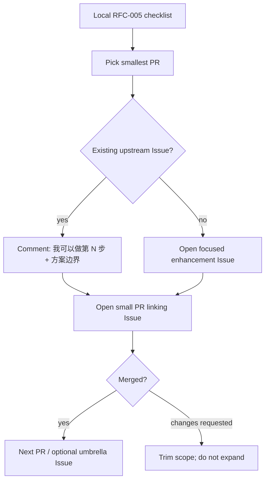

# RFC-005: Upstream contribution plan (fork → LegadoTeam)

Status: draft (local planning, corrected 2026-08-12 against upstream)
Date: 2026-08-11
Scope: How to land fork product work onto [LegadoTeam/legado](https://github.com/LegadoTeam/legado) in reviewable PRs, what **not** to upstream, and copy that actually persuades maintainers.

Related local RFCs: `rfc-001` (换源 ask order), `rfc-003` (author smart-merge), `rfc-004` (cross-source review).

---

## 1. Verdict (read this first)

| Question | Answer |
|---|---|
| Open a **GitHub Project** on LegadoTeam? | **No (default).** Need maintainer buy-in + `project` scopes; their cadence is Issue → small PR. |
| Track work where? | **Local checklist in this RFC** + optional **one umbrella Issue** on LegadoTeam after first PR lands. Own-fork Project is optional for you only. |
| How many PRs? | **First wave ~7** product PRs (not 283 commits; not 1 mega-PR). |
| First pitch? | Prefer **Issue that matches an existing ask**, then a **small PR that closes/partially addresses it**. |

Upstream already has overlapping user asks:

- [#697](https://github.com/LegadoTeam/legado/issues/697) 字数筛选应更细（章节向 / 单章换源钉住当前源）— upstream **already has** the toggle; this Issue wants finer behavior.
- [#666](https://github.com/LegadoTeam/legado/issues/666) 批量单章换源自动化接管 — discuss boundary before coding.
- [#664](https://github.com/LegadoTeam/legado/issues/664) 段评增强（部分子项已拆合；其余要协议样例）.

Hook PRs to those Issues when the fit is honest. Do **not** invent a parallel "mega roadmap Issue" before any code is reviewable.

---

## 2. Do / don't upstream

### Do (product, Android-facing)

1. Author smart-merge (empty/佚名 on search + shelf) — most independent.
2. Change-source quality toggles (filter non-novel, filter non-book-intro, drop content bad, early stop).
3. Change-source progress strip upgrade + wrong-book demotion + badges.
4. Auto-change on info/toc failure (capped, with progress).
5. Cross-source review overlay (RFC-004), **phased** to match upstream's "协议先于大 UI" preference seen on #664.

### Don't (keep on fork)

- MCP / Cursor 修书源通道
- `source-cli` / dig / hunt / shelf-stale scripts & docs
- Fork-only CI (`SyncUpstream.yml` and friends)
- Device acceptance screenshot dumps, Harness-only tests that need your phone farm

---

## 3. Project vs Issue vs PR



| Tool | Use? | Why |
|---|---|---|
| LegadoTeam **Project board** | **Not yet** | Needs org permission; maintainers already drive via Issues/PRs. Opening one unsolicited looks like process dump. |
| **Umbrella Issue** on LegadoTeam | **After 1–2 merges** | One tracker linking remaining PRs is enough; title like「换源质量与过滤：分步合入」. |
| **Project on `h11128/legado`** | Optional | Fine for your own WIP columns; do not require upstream to look at it. |
| **Discussion / 群** | Only if they already use it | Prefer public Issue comments so review history is searchable. |

---

## 4. PR sequence (first wave)

### 4.0 What upstream already has — do NOT re-pitch

Verified against `upstream/master` 2026-08-11. These exist upstream; fork does NOT add them:

| Feature | Upstream menu / commit | Note |
|---|---|---|
| 作者校验 toggle | `menu_check_author` | — |
| 加载字数 toggle | `menu_load_word_count` | — |
| **字数过滤 toggle（带 off/绝对/相对、min/max UI）** | `menu_word_count_filter` + full strings | Fork does NOT add. #697 asks for *finer* (per-chapter), not the toggle itself. |
| **按响应时间排序 toggle** | `menu_sort_respond_time` | Fork does NOT add. |
| 加载详情 / 加载目录 toggle | `menu_load_info` / `menu_load_toc` | — |
| 换源弹窗生命周期（PendingEvent） | #674 | Already merged this sync. |
| 批量单章换源缓存 | #659 | Already merged this sync. |
| JS 段评回复分页 | `020ddffa9` | Already merged this sync. |

**Implication:** PR1 is NOT "字数过滤 toggle" — upstream has it. PR1 is the most independent fork-only delta.

### 4.1 Fork-only delta (real contribution surface)

| Group | What | New files | Needs checkalgo? |
|---|---|---|---|
| **C. 作者 smart-merge** | 空/佚名作者合并（搜索 + 书架） | `BookAuthorIdentity.kt`, `SearchBookMerge.kt`, SearchViewModel/Shelf wiring | No — most independent |
| **A1. 非小说/非书籍简介过滤** | 2 toggle：`menu_filter_non_novel`, `menu_filter_non_book_intro` | `BookSourceTypeMapper.kt`, menu xml, ViewModel | Light (type sniff) |
| **A2. 内容差丢弃 + 提前停止** | 2 toggle：`menu_drop_content_bad`, `menu_early_stop` | `ChangeBookSourceQuality.kt`, `CheckAimdLimiter.kt`, `CheckHostEwma.kt` subset | **Yes — brings quality scorer** |
| **A3. 换源进度条升级** | 双行 metrics、early-stop 状态文案 | `ChangeSourceProgressFormat.kt`, `ChangeSourceProgressUi.kt` | On A2 events |
| **A4. 错书降权 + 徽章** | TOC 标题身份降权、TOC/最新章软元徽章 | `ChangeChapterVerify.kt` subset, Adapter badges | Yes |
| **B. 自动换源** | 详情/目录失败自动换源、上限 30、进度 | `AutoChangeSource.kt`, `AutoChangeProgress*.kt`, ReadBook/Info wiring | Yes + behavior change |
| **D. 段评 overlay (RFC-004)** | 跨源段评绑定 / overlay / auto-bind / merge | 12 files in `model/review/`, `ReviewMergeDetailDialog.kt`, 4 prefs | Phased, aligns #664 |

**Checkalgo 引擎**（22 files in `model/checkalgo/`）是 A2/A3/A4/B 的地基。**不要单独开"引擎" PR**——上游不会收一个没有用户可见功能的 22 文件引擎。每个 PR 只带它需要的那几块。

### 4.2 Corrected PR order

Order = **independence → default-safety → dependency depth**. Rebase on latest `LegadoTeam/legado` `master`, Chinese title, tests when behavior is non-obvious.

| # | PR | Group | Hook | Size | Why this position |
|---|---|---|---|---|---|
| 1 | 空/佚名作者 smart-merge（搜索 + 书架） | C | New Issue | M | **Most independent** — no checkalgo, default-safe (only merges when author empty/佚名), clear story. Best trust builder. |
| 2 | 过滤非小说 + 非书籍简介 toggle | A1 | New Issue | M | 2 toggles, default-off, light dependency. Builds on PR1 trust. |
| 3 | 内容差丢弃 + 提前停止 toggle | A2 | New Issue | M–L | **Brings quality scorer** (`ChangeBookSourceQuality` + minimal checkalgo). First PR carrying engine code; needs false-positive defense. |
| 4 | 换源进度条升级（双行 metrics + early-stop 状态） | A3 | — | S–M | Pure UX on PR3 events. Screenshot sells. Breathable after heavy PR3. |
| 5 | 错书降权 + TOC/最新章徽章 | A4 | — | M | First ranking change. Needs PR3 quality + PR1 trust. Default soft / pref-gated. |
| 6 | 失败自动换源（上限 30 + 进度 + 可关） | B | — | M–L | **Biggest behavior change** (App 主动换). After PR3/PR5 accepted. Pref-gated, default-off. |
| 7+ | 段评 overlay RFC-004 分 phase | D | #664 partial | M each | Upstream said protocol samples first (#664 comment). One phase per PR. |

**Not in this wave:**
- **#666 批量换章自动化（按键精灵）**: upstream just 合 #659 手动批量. Auto-range 是更大跃迁 — **先在 #666 讨论边界，再写代码**。
- **MCP / source-cli / dig / hunt / 修书源脚本**: 永远不进这批。

### 4.3 Why this order (one line each)

1. **PR1 作者 merge**: 不靠 checkalgo，最独立，故事最清楚（"同名空作者不再刷屏"）。
2. **PR2 非小说过滤**: 2 个 toggle，默认关，依赖浅（类型嗅探）。
3. **PR3 内容差+提前停止**: 第一次带 checkalgo 质量评分，必须给假阳性样例。
4. **PR4 进度条**: 纯 UX，截图卖，是 PR3 之后的轻 PR。
5. **PR5 错书降权**: 第一次动排序，靠 PR1 信任 + PR3 质量。
6. **PR6 自动换源**: 最大行为变化，App 主动换，必须最后碰。
7. **PR7+ 段评**: 跟上游 #664 节奏，一 phase 一 PR。

Skip opening all Issues at once. Open Issue+PR for #1 first; use maintainer reaction to pace the rest.

---

## 5. Persuasion copy (templates)

Tone: **场景 → 现状痛点 → 最小改动 → 默认安全 → 验证**. Match their Issue form. Avoid fork jargon (MCP、dig、Harness、RFC 编号可放「补充」不要当标题).

### 5.1 Comment on an existing Issue (before PR)

```text
我这边 fork 里已经有一版可运行的实现，想按「小步 PR」往上游合，先征求一下方向。

针对本 Issue，我建议第一刀只做：
- <一句话范围>
- 默认：<关闭 / 不影响现有路径>
- 不做：<明确砍掉的范围，避免一次塞太多>

验证：
- 单元测试：<有/无>
- 真机：<换源场景一句话>

如果这个边界 OK，我开 PR 链到本 Issue。
```

### 5.2 New enhancement Issue (when no hook)

Use LegadoTeam's template fields. Title examples:

- `书名相同且作者为空/佚名时合并搜索与书架条目`
- `换源结果支持过滤非小说源与非书籍简介源`

Body skeleton:

```markdown
### 使用场景
1. …
2. …

### 建议方案
- …
- 默认关闭或保持现状行为：…

### 可选方案
- 更大的自动换源 / 段评 overlay 另开 Issue，不塞进本 PR

### 补充材料
- 截图 / 录屏
- （可选）实现已在 fork 验证：链接到 commit 即可，不要贴整仓 diff
```

### 5.3 PR title + body

Titles like upstream: short Chinese, one change (`允许…` / `修复…` / `支持…`).

```markdown
## 摘要
- 解决：…
- 非目标：…

## 行为变化
- 默认：…
- 打开设置后：…

## 测试
- [ ] 单元测试 …
- [ ] 真机：换源 / 搜索 / 段评 …

Closes #<issue>   <!-- or: Partial #<issue> -->
```

### 5.4 One-liner "why merge" (per PR)

Use **one** of these, not a laundry list:

1. **作者 merge（PR1）：**「同一书名作者空/佚名不再刷一屏重复卡片，只在作者字段确实为空时合并。」
2. **非小说过滤（PR2）：**「书源噪声大时用户能过滤掉非小说源和字典简介源，默认关闭，不改变现有搜索。」
3. **内容差+提前停止（PR3）：**「内容差源可一键丢弃，够了好源就停，减少无效等待。」
4. **进度条（PR4）：**「长换源时能看见有效命中和停止进度，而不是空白转圈。」
5. **错书降权（PR5）：**「目录/最新章对不上的源往下沉，减少点进假书。」
6. **自动换源（PR6）：**「详情/目录加载失败时有上限地尝试可用源，带进度，可关。」
7. **段评 overlay（PR7+）：**「跨源段评绑定与合并，按 phase 合入，先协议后 UI。」

---

## 6. What actually persuades this repo

Observed maintainer pattern (2026-08): small Kotlin PRs, Chinese titles, tests on non-trivial fixes, Issues stay open when protocol is unclear (#664 comment).

| Do | Don't |
|---|---|
| Ship the smallest vertical slice | Paste "我们 fork 的 10 个 RFC 路线图" |
| Default-safe / pref-gated | Force new ranking on everyone |
| Link one Issue | Open Project + 12 Issues + 12 PRs day one |
| Rebase on latest master (they move fast) | PR against stale fork sync |
| Accept "拆小 / 先要样例" | Argue architecture in the first PR |
| Verify upstream already has it before pitching | Re-pitch 字数过滤 / 响应时间排序 (they exist) |

---

## 7. Local checklist

- [ ] Confirm PR1 scope (作者 smart-merge) still clean on top of latest upstream
- [ ] Write new Issue with §5.2 (no existing hook for author merge)
- [ ] Open PR1; wait for review signal before PR2
- [ ] After 1–2 merges: optional umbrella Issue listing remaining table rows
- [ ] Revisit #666 only after discussing auto-batch product boundaries
- [ ] Never upstream MCP / repair CLI in the same wave
- [ ] Before each PR: re-verify upstream didn't just add the same toggle/feature

---

## 8. Out of scope for this RFC

Implementation work, branch naming, or opening the first upstream PR. This file is the **plan + copy kit** only.
