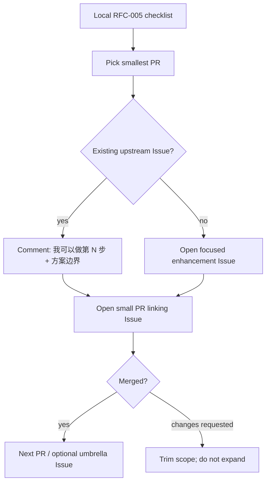
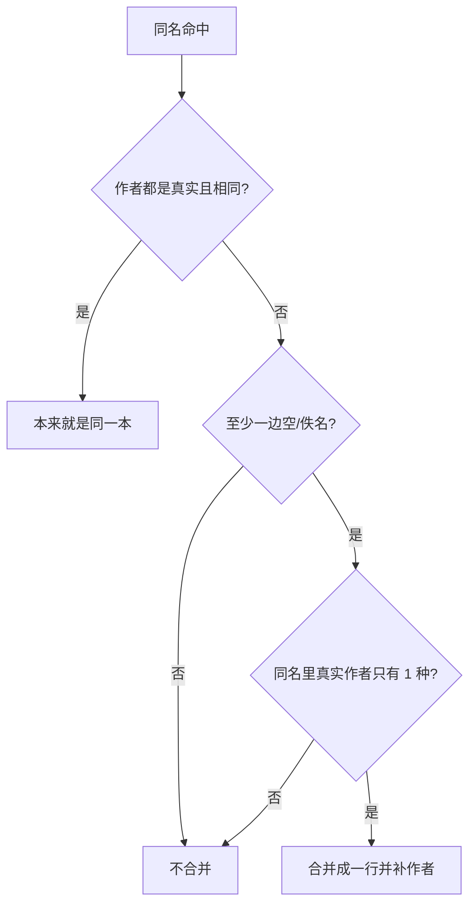
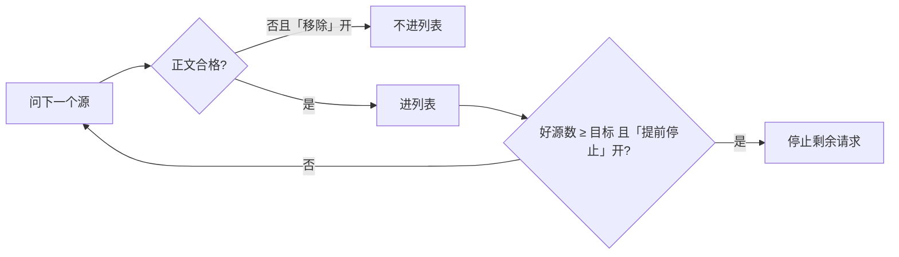
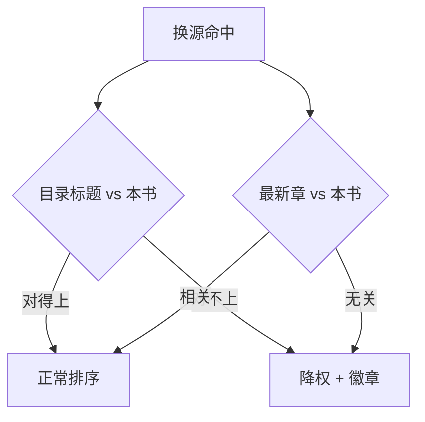
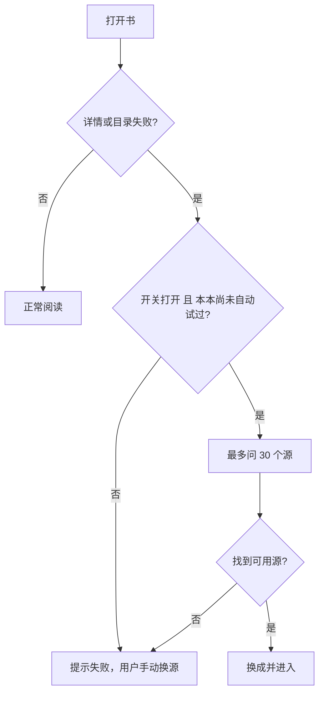
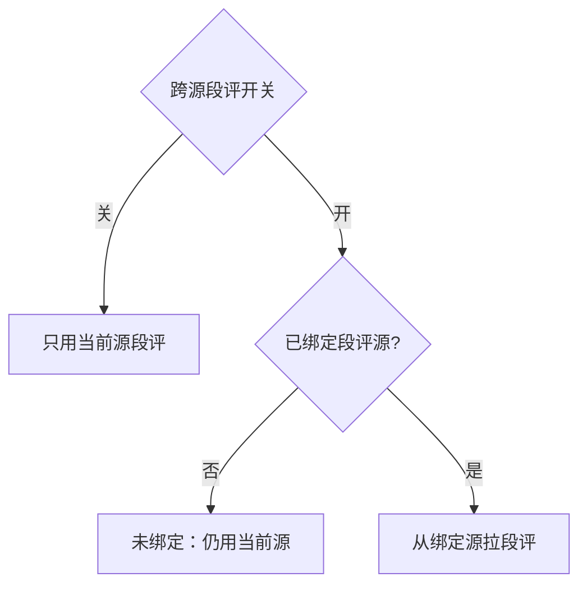
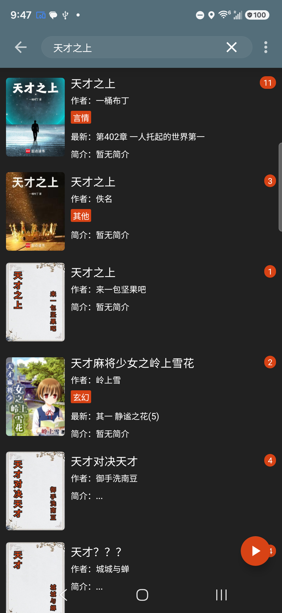
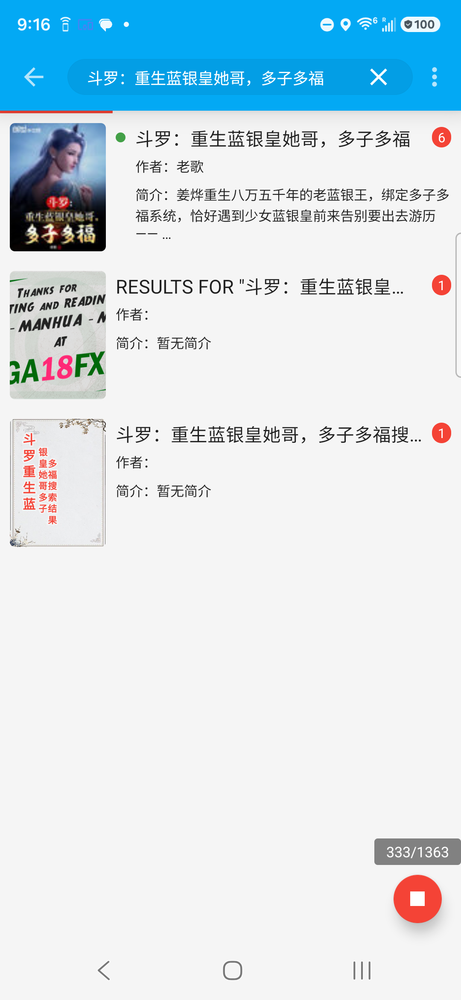
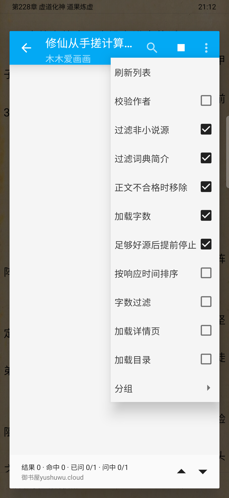
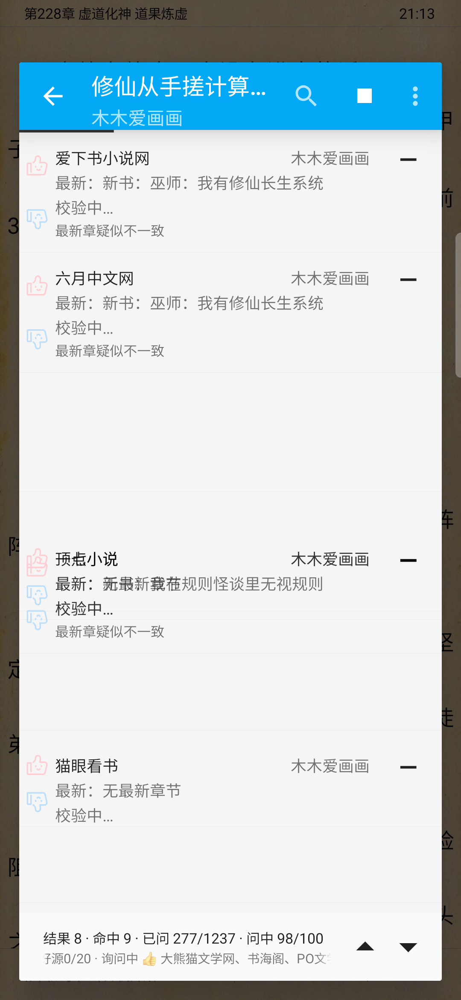

# RFC-005: Upstream contribution plan (fork → LegadoTeam)

Status: draft (local planning, corrected 2026-08-12 against upstream)
Date: 2026-08-11
Scope: How to land fork product work onto [LegadoTeam/legado](https://github.com/LegadoTeam/legado) in reviewable PRs, what **not** to upstream, and copy that actually persuades maintainers.

Related local RFCs: `rfc-001` (换源 ask order), `rfc-003` (author smart-merge), `rfc-004` (cross-source review).

---

## 1. Verdict (read this first)

| Question | Answer |
|---|---|
| Open a **GitHub Project** on LegadoTeam? | **No (default).** Need maintainer buy-in + `project` scopes; their cadence is Issue → small PR. |
| Track work where? | **Local checklist in this RFC** + optional **one umbrella Issue** on LegadoTeam after first PR lands. Own-fork Project is optional for you only. |
| How many PRs? | **First wave ~7** product PRs (not 283 commits; not 1 mega-PR). |
| First pitch? | Prefer **Issue that matches an existing ask**, then a **small PR that closes/partially addresses it**. |

Upstream already has overlapping user asks:

- [#697](https://github.com/LegadoTeam/legado/issues/697) 字数筛选应更细（章节向 / 单章换源钉住当前源）— upstream **already has** the toggle; this Issue wants finer behavior.
- [#666](https://github.com/LegadoTeam/legado/issues/666) 批量单章换源自动化接管 — discuss boundary before coding.
- [#664](https://github.com/LegadoTeam/legado/issues/664) 段评增强（部分子项已拆合；其余要协议样例）.

Hook PRs to those Issues when the fit is honest. Do **not** invent a parallel "mega roadmap Issue" before any code is reviewable.

---

## 2. Do / don't upstream

### Do (product, Android-facing)

1. Author smart-merge (empty/佚名 on search + shelf) — most independent.
2. Change-source quality toggles (filter non-novel, filter non-book-intro, drop content bad, early stop).
3. Change-source progress strip upgrade + wrong-book demotion + badges.
4. Auto-change on info/toc failure (capped, with progress).
5. Cross-source review overlay (RFC-004), **phased** to match upstream's "协议先于大 UI" preference seen on #664.

### Don't (keep on fork)

- MCP / Cursor 修书源通道
- `source-cli` / dig / hunt / shelf-stale scripts & docs
- Fork-only CI (`SyncUpstream.yml` and friends)
- Device acceptance screenshot dumps, Harness-only tests that need your phone farm

---

## 3. Project vs Issue vs PR



| Tool | Use? | Why |
|---|---|---|
| LegadoTeam **Project board** | **Not yet** | Needs org permission; maintainers already drive via Issues/PRs. Opening one unsolicited looks like process dump. |
| **Umbrella Issue** on LegadoTeam | **After 1–2 merges** | One tracker linking remaining PRs is enough; title like「换源质量与过滤：分步合入」. |
| **Project on `h11128/legado`** | Optional | Fine for your own WIP columns; do not require upstream to look at it. |
| **Discussion / 群** | Only if they already use it | Prefer public Issue comments so review history is searchable. |

---

## 4. PR sequence (first wave)

### 4.0 What upstream already has — do NOT re-pitch

Verified against `upstream/master` 2026-08-11. These exist upstream; fork does NOT add them:

| Feature | Upstream menu / commit | Note |
|---|---|---|
| 作者校验 toggle | `menu_check_author` | — |
| 加载字数 toggle | `menu_load_word_count` | — |
| **字数过滤 toggle（带 off/绝对/相对、min/max UI）** | `menu_word_count_filter` + full strings | Fork does NOT add. #697 asks for *finer* (per-chapter), not the toggle itself. |
| **按响应时间排序 toggle** | `menu_sort_respond_time` | Fork does NOT add. |
| 加载详情 / 加载目录 toggle | `menu_load_info` / `menu_load_toc` | — |
| 换源弹窗生命周期（PendingEvent） | #674 | Already merged this sync. |
| 批量单章换源缓存 | #659 | Already merged this sync. |
| JS 段评回复分页 | `020ddffa9` | Already merged this sync. |

**Implication:** PR1 is NOT "字数过滤 toggle" — upstream has it. PR1 is the most independent fork-only delta.

### 4.1 Fork-only delta (real contribution surface)

| Group | What | New files | Needs checkalgo? |
|---|---|---|---|
| **C. 作者 smart-merge** | 空/佚名作者合并（搜索 + 书架） | `BookAuthorIdentity.kt`, `SearchBookMerge.kt`, SearchViewModel/Shelf wiring | No — most independent |
| **A1. 非小说/非书籍简介过滤** | 2 toggle：`menu_filter_non_novel`, `menu_filter_non_book_intro` | menu xml, ViewModel, quality host/intro filters | Light |
| **A2. 内容差丢弃 + 提前停止** | 2 toggle：`menu_drop_content_bad`, `menu_early_stop` | `ChangeBookSourceQuality.kt`, `CheckAimdLimiter.kt`, `CheckHostEwma.kt` subset | **Yes — brings quality scorer** |
| **A3. 换源进度条升级** | 双行 metrics、early-stop 状态文案 | `ChangeSourceProgressFormat.kt`, `ChangeSourceProgressUi.kt` | On A2 events |
| **A4. 错书降权 + 徽章** | TOC 标题身份降权、TOC/最新章软元徽章 | `ChangeChapterVerify.kt` subset, Adapter badges | Yes |
| **B. 自动换源** | 详情/目录失败自动换源、上限 30、进度 | `AutoChangeSource.kt`, `AutoChangeProgress*.kt`, ReadBook/Info wiring | Yes + behavior change |
| **D. 段评 overlay (RFC-004)** | 跨源段评绑定 / overlay / auto-bind / merge | 12 files in `model/review/`, `ReviewMergeDetailDialog.kt`, 4 prefs | Phased, aligns #664 |

**Checkalgo 引擎**（22 files in `model/checkalgo/`）是 A2/A3/A4/B 的地基。**不要单独开"引擎" PR**——上游不会收一个没有用户可见功能的 22 文件引擎。每个 PR 只带它需要的那几块。

### 4.2 Corrected PR order

Order = **independence → default-safety → dependency depth**. Rebase on latest `LegadoTeam/legado` `master`, Chinese title, tests when behavior is non-obvious.

| # | PR | Group | Hook | Size | Why this position |
|---|---|---|---|---|---|
| 1 | 空/佚名作者 smart-merge（搜索 + 书架） | C | New Issue | M | **Most independent** — no checkalgo, default-safe (only merges when author empty/佚名), clear story. Best trust builder. |
| 2 | 过滤非小说 + 非书籍简介 toggle | A1 | New Issue | M | 2 toggles, default-off, light dependency. Builds on PR1 trust. |
| 3 | 内容差丢弃 + 提前停止 toggle | A2 | New Issue | M–L | **Brings quality scorer** (`ChangeBookSourceQuality` + minimal checkalgo). First PR carrying engine code; needs false-positive defense. |
| 4 | 换源进度条升级（双行 metrics + early-stop 状态） | A3 | — | S–M | Pure UX on PR3 events. Screenshot sells. Breathable after heavy PR3. |
| 5 | 错书降权 + TOC/最新章徽章 | A4 | — | M | First ranking change. Needs PR3 quality + PR1 trust. Default soft / pref-gated. |
| 6 | 失败自动换源（上限 30 + 进度 + 可关） | B | — | M–L | **Biggest behavior change** (App 主动换). After PR3/PR5 accepted. Pref-gated, default-off. |
| 7+ | 段评 overlay RFC-004 分 phase | D | #664 partial | M each | Upstream said protocol samples first (#664 comment). One phase per PR. |

**Not in this wave:**
- **#666 批量换章自动化（按键精灵）**: upstream just 合 #659 手动批量. Auto-range 是更大跃迁 — **先在 #666 讨论边界，再写代码**。
- **MCP / source-cli / dig / hunt / 修书源脚本**: 永远不进这批。

### 4.3 Why this order (one line each)

1. **PR1 作者 merge**: 不靠 checkalgo，最独立，故事最清楚（"同名空作者不再刷屏"）。
2. **PR2 非小说过滤**: 2 个 toggle，默认关，依赖浅（类型嗅探）。
3. **PR3 内容差+提前停止**: 第一次带 checkalgo 质量评分，必须给假阳性样例。
4. **PR4 进度条**: 纯 UX，截图卖，是 PR3 之后的轻 PR。
5. **PR5 错书降权**: 第一次动排序，靠 PR1 信任 + PR3 质量。
6. **PR6 自动换源**: 最大行为变化，App 主动换，必须最后碰。
7. **PR7+ 段评**: 跟上游 #664 节奏，一 phase 一 PR。

Skip opening all Issues at once. Open Issue+PR for #1 first; use maintainer reaction to pace the rest.

---

## 5. Persuasion copy (templates)

Tone: **场景 → 现状痛点 → 最小改动 → 默认安全 → 验证**. Match their Issue form. Avoid fork jargon (MCP、dig、Harness、RFC 编号可放「补充」不要当标题).

### 5.1 Comment on an existing Issue (before PR)

```text
我这边 fork 里已经有一版可运行的实现，想按「小步 PR」往上游合，先征求一下方向。

针对本 Issue，我建议第一刀只做：
- <一句话范围>
- 默认：<关闭 / 不影响现有路径>
- 不做：<明确砍掉的范围，避免一次塞太多>

验证：
- 单元测试：<有/无>
- 真机：<换源场景一句话>

如果这个边界 OK，我开 PR 链到本 Issue。
```

### 5.2 New enhancement Issue (when no hook)

Use LegadoTeam's template fields. Title examples:

- `书名相同且作者为空/佚名时合并搜索与书架条目`
- `换源结果支持过滤非小说源与非书籍简介源`

Body skeleton:

```markdown
### 使用场景
1. …
2. …

### 建议方案
- …
- 默认关闭或保持现状行为：…

### 可选方案
- 更大的自动换源 / 段评 overlay 另开 Issue，不塞进本 PR

### 补充材料
- 截图 / 录屏
- （可选）实现已在 fork 验证：链接到 commit 即可，不要贴整仓 diff
```

### 5.3 PR title + body

Titles like upstream: short Chinese, one change (`允许…` / `修复…` / `支持…`).

**Every PR MUST include a "示意图" section** (see §5.5). A PR with only text will be skimmed and stalled.

```markdown
## 摘要
- 解决：…
- 非目标：…

## 示意图
<!-- before/after 截图 or 录屏 GIF，见 §5.5 选型 -->

## 行为变化
- 默认：…
- 打开设置后：…

## 测试
- [ ] 单元测试 …
- [ ] 真机：换源 / 搜索 / 段评 …

Closes #<issue>   <!-- or: Partial #<issue> -->
```

### 5.4 One-liner "why merge" (per PR)

Use **one** of these, not a laundry list:

1. **作者 merge（PR1）：**「同一书名作者空/佚名不再刷一屏重复卡片，只在作者字段确实为空时合并。」
2. **非小说过滤（PR2）：**「书源噪声大时用户能过滤掉非小说源和字典简介源，默认关闭，不改变现有搜索。」
3. **内容差+提前停止（PR3）：**「内容差源可一键丢弃，够了好源就停，减少无效等待。」
4. **进度条（PR4）：**「长换源时能看见有效命中和停止进度，而不是空白转圈。」
5. **错书降权（PR5）：**「目录/最新章对不上的源往下沉，减少点进假书。」
6. **自动换源（PR6）：**「详情/目录加载失败时有上限地尝试可用源，带进度，可关。」
7. **段评 overlay（PR7+）：**「跨源段评绑定与合并，按 phase 合入，先协议后 UI。」

### 5.5 示意图选型（每个 PR 必须有）

**原则：维护者看图 10 秒决定要不要读正文。** 没图 = 没人审。

| 类型 | 何时用 | 怎么做 |
|---|---|---|
| **Before/After 截图** | 列表 / 卡片 / 排序变化 | 两张手机截图并排，红框标差异 |
| **录屏 GIF** | 动画 / 进度 / 自动行为 | 录 5–10s，转 GIF，<2MB |
| **菜单截图** | 新 toggle / 设置项 | 展开菜单的截图 + 箭头指新项 |
| **Mermaid 流程** | 协议 / 状态机 / 触发条件 | 只在截图说不清时用（如段评绑定 phase） |

**截图要求：**
1. 真机截，不要模拟器
2. 中文界面（上游是中文项目）
3. 红框 / 箭头标变化点，别让审查者找
4. 文件名 `prN-before.png` / `prN-after.png`，放 PR 描述里
5. GIF 用 `prN-demo.gif`

**每个 PR 的完整说明、流程、界面示意见 §9。** 真机证据只要 **3 组**（不要每个 PR 都拍 before/after）：

| # | 讲什么 | 真机文件 |
|---|---|---|
| 1 | 空/佚名作者 merge | `pr1-before.png` / `pr1-after.png` |
| 2 | 换源菜单新开关 vs 上游已有 | `pr2-menu.png` |
| 3 | 换源进行中（双行进度 + 徽章） | `pr2-after.png` |

其余 PR 开 PR 时复用这 3 组 + §9 示意图即可。

**不要做的：**
- 不要贴整页长截图，裁到变化区域
- 不要贴 fork 专属的调试 / MCP / dig 截图
- 不要用英文界面截图
- 不要只放文字描述「效果是…」而不给图

---

## 6. What actually persuades this repo

Observed maintainer pattern (2026-08): small Kotlin PRs, Chinese titles, tests on non-trivial fixes, Issues stay open when protocol is unclear (#664 comment).

| Do | Don't |
|---|---|
| Ship the smallest vertical slice | Paste "我们 fork 的 10 个 RFC 路线图" |
| Default-safe / pref-gated | Force new ranking on everyone |
| **Include 示意图 in every PR** | Text-only PR description |
| Link one Issue | Open Project + 12 Issues + 12 PRs day one |
| Rebase on latest master (they move fast) | PR against stale fork sync |
| Accept "拆小 / 先要样例" | Argue architecture in the first PR |
| Verify upstream already has it before pitching | Re-pitch 字数过滤 / 响应时间排序 (they exist) |

---

## 7. Local checklist

- [ ] Confirm PR1 scope (作者 smart-merge) still clean on top of latest upstream
- [ ] Write new Issue with §5.2 (no existing hook for author merge)
- [ ] Device shots: `python scripts/rfc005-pr-screenshot-session.py` → `docs/design/rfc-005-assets/` (§10)
- [ ] Open PR1: paste §9 PR1 body + §10 image; wait for review before PR2
- [ ] After 1–2 merges: optional umbrella Issue listing remaining table rows
- [ ] Revisit #666 only after discussing auto-batch product boundaries
- [ ] Never upstream MCP / repair CLI in the same wave
- [ ] Before each PR: re-verify upstream didn't just add the same toggle/feature

---

## 8. Out of scope for this RFC

Implementation work, branch naming, or opening the first upstream PR. Ready-to-paste copy and diagrams live in §9; **真机截图 / GIF 仍在开 PR 前按 §5.5 补**，本节示意图只负责让审查者先看懂 feature。

---

## 9. Per-PR briefing pack（开 PR 时直接贴）

每个 PR 包含：**建议标题、给维护者看的说明、默认/非目标、示意图（Mermaid + 界面示意）**。  
真机证据全计划只要 **§5.5 / §10 的 3 组**，不要每个 PR 再拍一套 before/after。贴 GitHub 时：§9 文字进 PR body，相关真机图按文件名上传。

### PR1 — 空/佚名作者 smart-merge

**建议标题：** `支持书名相同且作者为空/佚名时合并搜索与书架条目`

**给维护者看的说明：**

搜索和书架认书靠「书名 + 作者」。很多书源把作者写成空、`佚名`、`未知`，会被当成另一本书，同一本刷出一排重复卡片。

本 PR 只在下面同时成立时合并：

1. 书名去空格后相同
2. 至少一边作者是空 / 占位（佚名、未知、unknown…）
3. 同名命中里**真实作者只有一种** → 合并并补上那个作者
4. 真实作者 ≥2 种 → **不猜**，保持分开

搜索结果折叠来源；书架合并重复行。不删本地书，不在已有 `(书名, 真实作者)` 上硬改作者撞库。

**默认：** 始终按上述规则合并（没有「关」开关）。不满足条件时行为和现在一样。  
**非目标：** 不同书同名不同作者的合并；改书源 HTML；MCP / 校验引擎。

**示意图（开 PR 前换成真机图 `pr1-before.png` / `pr1-after.png`）：**



```
搜索「斗破苍穹」

Before                         After
┌─────────────────────┐        ┌─────────────────────┐
│ 斗破苍穹 · 佚名     │        │ 斗破苍穹 · 天蚕土豆 │
│ 来源 A              │        │ 来源 A / B / C      │
├─────────────────────┤        └─────────────────────┘
│ 斗破苍穹 · （空）   │
│ 来源 B              │
├─────────────────────┤
│ 斗破苍穹 · 天蚕土豆 │
│ 来源 C              │
└─────────────────────┘
真实作者 ≥2 种时不合并（例如「张三」和「李四」并排）。
```

**真机图：** `pr1-before.png` / `pr1-after.png`（搜「天才之上」：上游佚名单独一行；fork 因真实作者 ≥2 种，空/佚名仍不并进「一桶布丁」）。

---

### PR2 — 过滤非小说源 + 词典简介

**建议标题：** `换源菜单增加过滤非小说源与词典简介`

**说明：**

换源列表常混进漫画站、影视站、词典/百科简介页，看起来像书、点进去不是小说。上游已有作者校验、加载字数、**字数过滤**、按响应时间排序——本 PR **不再重复那些**。

只加两个默认关闭的菜单项：

- `过滤非小说源`：按书源类型/主机规则丢掉明显不是小说的源
- `过滤词典简介`：丢掉只有词典/百科简介、没有正文目录的命中

过滤后若列表被掏空，回退到未过滤列表，避免换源完全跑不了。

**默认：** 两个 toggle 关闭 = 和现在一模一样。  
**非目标：** 改排序；字数过滤（上游已有）；错书降权（PR5）；checkalgo 全量引擎。

**示意图：**

```
换源 · 菜单（仅标新项）

  筛选…
  停止 / 刷新
  书源管理
  刷新列表
  校验作者              ← 上游已有
▶ 过滤非小说源          ← NEW
▶ 过滤词典简介          ← NEW
  加载字数              ← 上游已有
  按响应时间排序        ← 上游已有
  字数过滤              ← 上游已有
```

```
Before（关）                    After（开）
┌──────────────────────┐        ┌──────────────────────┐
│ 笔趣阁 · 正文        │        │ 笔趣阁 · 正文        │
│ 某某词典 · 词条简介  │  ──►   │ 起点   · 正文        │
│ 某某影视 · 剧集      │        └──────────────────────┘
│ 起点   · 正文        │        词典/影视行消失
└──────────────────────┘
```

**真机图：** 复用 `pr2-menu.png`。

---

### PR3 — 正文不合格移除 + 足够好源后提前停止

**建议标题：** `换源支持丢弃不合格正文，并在足够好源后提前停止`

**说明：**

长换源会把整份书源表问完：空壳、防盗短章、广告劫持也会占着列表。本 PR 两个默认关闭的 toggle：

- `正文不合格时移除`：本章过短 / 空壳 / 明显劫持时从结果里拿掉
- `足够好源后提前停止`：已经攒够「合格源」数量就停，不再扫完全表

这是第一批带上**最小质量判断**的 PR（不是 22 文件引擎一次性合入）。PR 正文必须写清假阳性：宁可漏过滤，不要误杀正常短章（例如诗词、番外）。

**默认：** 关闭 = 行为与现在相同。  
**非目标：** 改默认排序；进度条文案升级（PR4）；错书徽章（PR5）。

**示意图：**



```
录屏分镜（pr3-demo.gif，5–10s）
1. 打开换源菜单，勾选两个新项
2. 进度从「已问 12/180」跳到「已足够好源（8）· 正在停止」
3. 列表只剩合格源，底部不再无限转
```

**真机图：** 复用 `pr2-menu.png` + `pr2-after.png`（不必单独 GIF）。

---

### PR4 — 换源进度条双行 metrics

**建议标题：** `换源进度改为双行：计数与当前源名分开`

**说明：**

上游进度是单行：`Result 5, Progress 20/100: 某书源`。源名一长，数字被挤掉。本 PR 拆成两行，不改谁进列表、谁排前面。

- 第一行：结果数 · 命中 · 已问/总数 · 问中并发
- 第二行：当前源名（或「空闲 / 完成 / 正在停止」），过长跑马灯

提前停止时第一行换成「已足够好源（n）· 已停止 x/y」。

**默认：** 换源弹窗始终用新文案（显示层，不改搜索）。  
**非目标：** 新 toggle；质量算法。

**示意图：**

```
Before（单行，源名吃掉数字）
┌─────────────────────────────────────────┐
│ Result 5, Progress 20/100: 某个很长的书源名称… │
└─────────────────────────────────────────┘

After（双行）
┌─────────────────────────────────────────┐
│ 结果 5 · 命中 3 · 已问 20/100 · 问中 3/8 │
│ 正在问：笔趣阁                           │
│ ████████░░░░░░░░░░░░                    │
└─────────────────────────────────────────┘

提前停止
┌─────────────────────────────────────────┐
│ 结果 8 · 命中 8 · 已足够好源（8）· 已停止 40/180 │
│ 正在停止…                               │
└─────────────────────────────────────────┘
```

**真机图：** 复用 `pr2-after.png`（双行计数已在图里）。

---

### PR5 — 错书降权 + TOC/最新章徽章

**建议标题：** `换源对目录/最新章不一致的源降权并显示标记`

**说明：**

错书、盗版聚合站常能搜到同名，但目录标题对不上、最新章完全不相关。本 PR **不删除**这些源，只：

- 往列表下面沉（软降权）
- 行上打「目录疑似不一致 / 最新章疑似不一致」标记

默认软处理，避免误杀改名连载。这是第一刀动排序的 PR，必须放在 PR3 质量判断被接受之后。

**默认：** 软降权 + 徽章；不从列表移除。  
**非目标：** 自动换源（PR6）；硬删除错书。

**示意图：**

```
Before                         After
┌─────────────────────┐        ┌─────────────────────┐
│ 假书站  ★★★★       │        │ 正版站  ★★★★       │
│ 正版站  ★★★        │   ►    │ 备用站  ★★★        │
│ 备用站  ★★         │        │ 假书站  ★  ⚠最新章疑似不一致 │
└─────────────────────┘        └─────────────────────┘
```



**真机图：** 复用 `pr2-after.png` 行上「最新章节疑似不一致」。

---

### PR6 — 详情/目录失败时自动换源

**建议标题：** `书籍详情或目录加载失败时支持有上限的自动换源`

**说明：**

书源挂了以后，用户要点换源、等搜索、再点一条。本 PR 在**详情失败 / 目录失败 / 书源已不存在**时自动试别的源：

- 最多问 **30** 个源（不是全表扫描）
- 带进度条（已问 / 问中）
- **可关**；同一本书进程内只自动试一次，避免死循环
- 成功后走现有换源落点，不另造一套

必须在 PR3/PR5 之后：自动换源等于「机器替用户做质量选择」。

**默认：关闭。** 打开后才在失败路径触发。  
**非目标：** 按键精灵式批量单章自动换（#666）；MCP。

**示意图：**



```
录屏分镜（pr6-demo.gif）
1. 打开一本死源书 → 详情转圈失败
2. 底部/顶栏出现「自动换源 · 已问 4/30 · 问中 2/8」
3. 切到可用源，进度消失，封面/目录出来
```

**真机图：** 开 PR 时若进度条文案可见，复用 `pr2-after.png`；不必单独 GIF。

---

### PR7+ — 跨源段评 overlay（分 phase）

**建议标题（第一刀）：** `阅读设置增加跨源段评绑定（仅绑定基础）`

后续 phase 各开一 PR：段落图标 → 自动发现绑定 → 多源合并。挂 [#664](https://github.com/LegadoTeam/legado/issues/664) 时只写 **Partial**，不要声称关掉整个 Issue。

**说明（第一刀）：**

正文源往往没有段评；起点/番茄等有段评但不是当前正文源。第一刀只做：

- 阅读设置里「跨源段评」开关（默认关）
- 把书绑定到一个「段评源」
- 未绑定 / 开关关 = 只用当前源原有段评（和现在一样）

不在这一刀做：段落图标、静默自动绑定、多源合并计数。上游 #664 要求协议样例先于大 UI。

**示意图：**



```
设置 → 阅读界面
  ☐ 跨源段评          ← PR7 第一刀
  ☐ 自动发现段评源    ← 后一 PR
  ☐ 段落段评图标      ← 后一 PR
  ☐ 多源章节段评合并  ← 后一 PR
```

**真机图：** 开该 PR 时再补设置页一张即可；不纳入 §10 的 3 组。

---

## 10. Device evidence (2026-08-13, SM-A366U1)

只要 **3 组**。PR1 before 来自上游正式包 `legado_app_3.26081201_universal_release`（`com.legado.app.release`）；after 是 fork debug。

重拍 PR1：`python scripts/rfc005-capture-pr1-before.py --query 天才之上 --skip-install`  
重拍 2/3：`python scripts/rfc005-pr-screenshot-session.py --no-prefs --only cs`

### 1. 作者 merge（搜「天才之上」）



上游：同名分行，**佚名**单独一张（徽标 3），旁边是「一桶布丁」。



fork：真实作者「一桶布丁 / 来一包坚果吧 / 怪我咯」仍分行；空作者单独一行（**没有**并进一桶布丁）。这才是 PR1 的智能判断：同名且真实作者 ≥2 种时，佚名/空 **不猜**。徽标 11→20 是 debug 书源更多，不是把佚名吃进一桶布丁。

### 2. 换源菜单



新开关：过滤非小说源、词典简介、正文不合格移除、足够好源后提前停止。上游已有：校验作者、加载字数、按响应时间排序、字数过滤。

### 3. 换源进行中



双行进度 `结果 · 命中 · 已问/问中`，行上「最新章节疑似不一致」。

