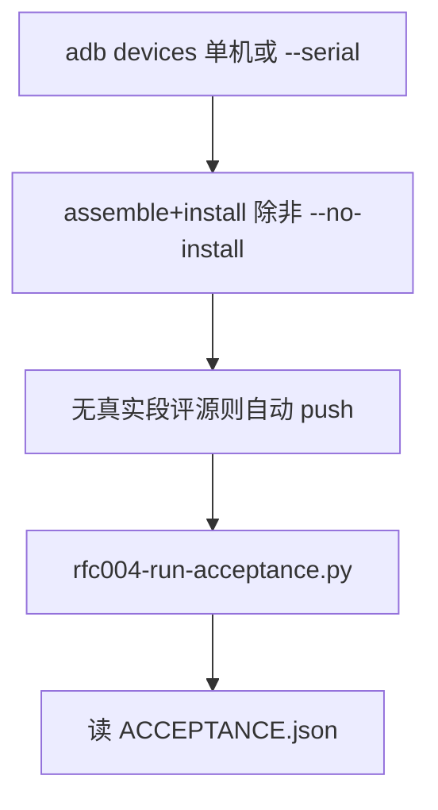

# RFC-004 段评无缝自动绑 — 一键验收指南（agent 用）

Date: 2026-08-09  
Audience: agents / 真机回归  
Package: `com.legado.app.debug`  
Probe book: 《诡秘之主》/ 爱潜水的乌贼  

**唯一入口（不要再写 temp 手写 adb）：**

```bash
python scripts/rfc004-run-acceptance.py
python scripts/rfc004-run-acceptance.py --no-install
python scripts/rfc004-run-acceptance.py --mode smoke          # 仅 G1–G3
python scripts/rfc004-run-acceptance.py --from G8 --no-install
python scripts/rfc004-run-acceptance.py --only G9 --no-install
python scripts/rfc004-run-acceptance.py --probe-only
python scripts/rfc004-run-acceptance.py --serial <SERIAL>
```

成功：exit 0，`temp/rfc004_ui/acceptance/ACCEPTANCE.json` 里 `PASS: true`。  
失败：exit ≠0，**同文件仍会写出** `PASS: false` + `fail` + 已过门（勿只看缺 JSON）。

`--from` / `--only`：**默认不自动 push 源**（假定机上已有）；缺源时显式加 `--push-sources`。  
从 G2/G3 续跑会重新 `prepare`（关夹具、清 bindings）。仅 G8/G9 续跑复用现有绑定。  
`--mode smoke` 只跑 G1–G3；与 `--from`/`--only` 交集为空会直接 FAIL（不会假 PASS）。

共享库：`scripts/lib/rfc004_device.py`（adb / WAL DB / prefs / UI / logcat AppLog）。  
实现：`scripts/rfc004-autobind-acceptance-ui.py`（被入口调用）。  
夹具冒烟总表：[rfc-004-review-overlay-device-verify.md](./rfc-004-review-overlay-device-verify.md)。

---

## 1. 验收在验什么（G1–G9）

| 门 | 含义 | 通过证据 |
|---|---|---|
| G1 | 夹具关闭，只用真实 `#rfc004-review` 源 | 日志 capable 列表无 `legado-fixture://` |
| G2 | 静默自动绑 ≥2 真实源，`bindMode=auto` | DB bindings；无 fixture URL |
| G3 | Overlay 有正 bucket / merge | AppLog `merge providers=` 或 `bucket>0` |
| G4 | 阅读页可见 | `G4_read_title.png` |
| G5 | 真评论对话框（无「夹具」字样） | `G5_comment_dialog.png` |
| G6 | 多源合集 UI | `G6_merge_dialog.png` 或 merge log |
| G7 | 起点段权威开门且硬映射 | `authority=ContentSplitVerified` |
| G8 | 简介「段评源」已绑定 | `G8_book_info.png` 含「已绑定 N 个」 |
| G9 | 关自动发现 → 不再静默绑 | `G9_neg_read.png`；无 `auto-bind scan` |

`ACCEPTANCE.json` 的 `gates` 为结构化：`{ok, evidence, shot}`。

已知良好样本（2026-08-09）：起点+QQ 双绑；`merge providers=2`；`coverage=69/69`。

---

## 2. 推荐流程



1. 确认单设备，或传 `--serial`。  
2. 跑一键脚本。  
3. 失败看 JSON `fail` + 对应 PNG / `session_*.log`，用 `--from` / `--only` 续跑，不要重写流程。

可选探针（不替代 G1–G9）：

```bash
python scripts/rfc004-run-acceptance.py --probe-only
```

---

## 3. 经验教训

### 3.1 夹具污染「假通过」

验收强制关 `legado-fixture://*`。人肉测也要先关。

### 3.2 「测过了」≠ 全套截图

只看 bucket 或只绑起点不算。full 模式必须 G2≥2、G6、G8、G9。

### 3.3 QQ 空作者 → sameBook 失败

peer 须含正文 `book.author`。

### 3.4 Native origin 是段评源时也要能 auto-bind

Native / Overlay 不完整也要 `maybeProposeReviewAutoBind`。

### 3.5 串行搜索会烧时间

`proposeAll` 必须并行；脚本侧用 AppLog 过滤轮询，勿全量 `logcat -d`。

### 3.6 BookInfoActivity 未 exported

经阅读菜单点书名进简介（脚本已封装）。

### 3.7 截图必须在 force-stop 之前

合集对话框截完再停应用。

### 3.8 `textCount` ≠ `paragraphId`

探针：`--probe-only`。

### 3.9 段角标只对已验证权威源开门

夹具 + 起点同源可 `ContentSplitVerified`。

### 3.10 多设备必须选 serial

多机且未设 `ANDROID_SERIAL` / `--serial` → 直接 FAIL。

---

## 4. 脚本地图（整合后）

| 路径 | 角色 |
|---|---|
| **`scripts/rfc004-run-acceptance.py`** | **唯一 agent 入口** |
| `scripts/rfc004-autobind-acceptance-ui.py` | G1–G9 实现 |
| `scripts/lib/rfc004_device.py` | 共享 adb/DB/prefs/UI/log |
| `scripts/push-rfc004-review-sources.py` | 推真实段评源（入口可自动调） |
| `scripts/rfc004-probe-qidian-para-align.py` | 段号探针（`--probe-only`） |
| `scripts/rfc004-overlay-device-session.py` | **夹具** overlay / `--merge`（仍独立，用共享库） |
| `scripts/rfc004-p5-merge-ui-session.py` | **夹具** 双源 merge UI（共享库） |
| `scripts/rfc004-autobind-device-session.py` | **薄包装** → `--mode smoke` |
| `scripts/rfc004-autobind-real-ui-session.py` | **薄包装** → full |
| `scripts/rfc004-p5-real-providers-ui-session.py` | **薄包装** → full |

产物：`temp/rfc004_ui/acceptance/`（每次开跑清空文件）。

---

## 5. 失败时最少动作

1. 读 `ACCEPTANCE.json` 的 `fail` / `gates`。  
2. 打开对应 `G*.png` / `session_positive.log` / `session_negative.log`。  
3. 修代码或补源后：  
   `python scripts/rfc004-run-acceptance.py --no-install --from Gx`  
4. 禁止新开 temp/ 手写流程。

---

## 6. 与产品行为对齐

- 自动绑默认开；可在阅读设置关。  
- 每源 `sameBook` 恰好 1 命中才绑。  
- 多源合的是章评；段角标仍一家 `paragraph_primary` + 权威门禁。  
- 禁用行不会被 auto 复活。
