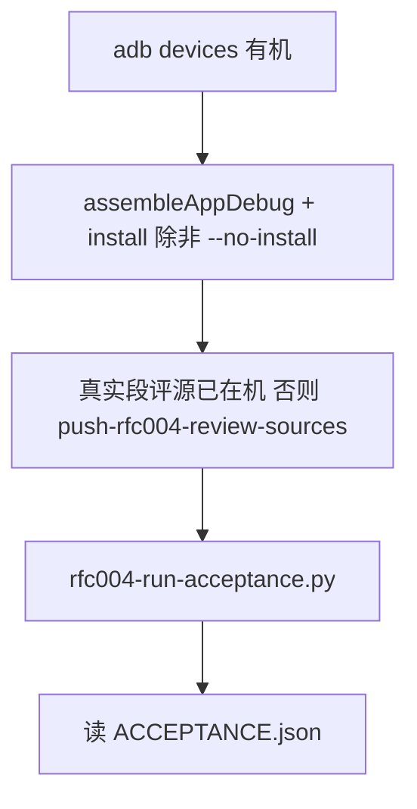

# RFC-004 段评无缝自动绑 — 一键验收指南（agent 用）

Date: 2026-08-09  
Audience: agents / 真机回归  
Package: `com.legado.app.debug`  
Probe book: 《诡秘之主》/ 爱潜水的乌贼  

**一键入口（优先用这个，少读少点）：**

```bash
python scripts/rfc004-run-acceptance.py
# APK 已是当前代码时：
python scripts/rfc004-run-acceptance.py --no-install
```

成功：exit 0，打印 `temp/rfc004_ui/acceptance/ACCEPTANCE.json`。  
失败：exit ≠0，看同目录 PNG / `session_*.log`。

相关实现验收脚本：`scripts/rfc004-autobind-acceptance-ui.py`（被一键入口调用）。  
设备冒烟总表（夹具 P1–P5）：[rfc-004-review-overlay-device-verify.md](./rfc-004-review-overlay-device-verify.md)。

---

## 1. 验收在验什么（G1–G9）

| 门 | 含义 | 通过证据 |
|---|---|---|
| G1 | 夹具关闭，只用真实 `#rfc004-review` 源 | 日志 capable 列表无 `legado-fixture://` |
| G2 | 静默自动绑 ≥2 真实源，`bindMode=auto` | DB bindings；无 fixture URL |
| G3 | Overlay 有正 bucket / merge | logcat `merge providers=… bucket=…` 或 `bucket>0` |
| G4 | 阅读页可见 | `G4_read_title.png` |
| G5 | 真评论对话框（无「夹具」字样） | `G5_comment_dialog.png` + UI 文案 |
| G6 | 多源合集 UI | `G6_merge_dialog.png`；期望「本章评论（K 源）」 |
| G7 | 起点段权威开门且硬映射 | log `authority=ContentSplitVerified coverage=… paras=…` |
| G8 | 简介「段评源」已绑定 | `G8_book_info.png` 含「已绑定 N 个」 |
| G9 | 关自动发现 → 不再静默绑 | `G9_neg_read.png`；无 `auto-bind scan`；bindings=0 |

已知良好样本（2026-08-09）：起点+QQ 双绑；`merge providers=2 bucket=11195`；`coverage=69/69`；简介「已绑定 2 个」。

---

## 2. 推荐流程（agent 最短路径）



1. 确认 `adb devices` 有一台设备。  
2. 跑一键脚本（默认会编安装 debug APK）。  
3. **不要**再手点 UI / 再开夹具会话，除非 JSON 失败需要排障。  
4. 失败时按第三节教训对号入座，改完再跑同一命令。

可选探针（段号坐标系，不替代 G1–G9）：

```bash
python scripts/rfc004-probe-qidian-para-align.py
```

---

## 3. 经验教训（写进脚本前踩过的坑）

### 3.1 夹具污染「假通过」

夹具留在 `enabled=1` 时，capable 扫描会混进 fixture，评论也可能是假数据。  
**验收脚本强制** `legado-fixture://*` → `enabled=0`。人肉测也要先关夹具。

### 3.2 「测过了」≠ 截图验收全过

只看 `bucket=11175` 或只绑起点，**不算**全套验收。必须 G2≥2、G6 合集标题、G8 简介、G9 负向都有截图/JSON。

### 3.3 QQ 唯一书名但作者空 → sameBook 失败

QQ 搜索卡片常 `author=""`；peer 集合若不含**正文作者**，`soleRealAuthor` 为空 → `sameBook` false → 永不自动绑。  
**修法：** `ReviewOverlayMatch.searchSameBookHits` 把 `book.author` 并进 peerAuthors。

### 3.4 Native origin 是段评源时不会走 Unbound

书架书 `origin=起点段评源` 时 resolver 走 `Native`，旧逻辑不跑 auto-bind。  
**修法：** Native / Overlay 不完整绑定也调用 `maybeProposeReviewAutoBind`；capable origin 合成进 binding。

### 3.5 串行搜索 × 30s 超时 = token/时间黑洞

7 源串行可达数分钟，agent 空等。  
**修法：** `proposeAllFromCapable` 并行 `async`；验收脚本轮询 logcat 即可。

### 3.6 BookInfoActivity 不能 am start

未 exported → shell `am start` Permission Denial。  
**修法：** 阅读页中键出菜单 → 点书名进简介（脚本已封装）。

### 3.7 截图必须在 force-stop 之前

先 `force-stop` 再 `screencap` 会拍到桌面（假 G6）。  
**修法：** 合集对话框截图留在停应用之前。

### 3.8 `textCount` ≠ `paragraphId`

起点 `textCount=5009` 是评论条数；段号是 `1..N`。误读会导致错误结论「opaque id 对不上」。探针：`rfc004-probe-qidian-para-align.py`。

### 3.9 段角标只对已验证权威源开门

夹具 + **起点**（同源正文）可为 `ContentSplitVerified`。盗版正文 ↔ 起点段评仍可能 coverage 塌，不要对任意源乱开门。

### 3.10 门闩与 Overlay 补槽

auto-bind 只在扫完「无提案」或槽满后标记 done；失败/空扫可重试；Overlay 已有 1 绑仍可补到 mergeMax。

---

## 4. 脚本地图（别再写 temp 一次性脚本）

| 脚本 | 用途 |
|---|---|
| **`scripts/rfc004-run-acceptance.py`** | **一键全套 G1–G9**（agent 默认） |
| `scripts/rfc004-autobind-acceptance-ui.py` | 验收实现（被一键调用） |
| `scripts/rfc004-autobind-device-session.py` | 仅静默绑 + log（无全截图） |
| `scripts/rfc004-autobind-real-ui-session.py` | 真实源 UI 冒烟（轻量） |
| `scripts/rfc004-probe-qidian-para-align.py` | 起点段号 vs 拆段 |
| `scripts/push-rfc004-review-sources.py` | 推真实段评源到机 |
| `scripts/rfc004-overlay-device-session.py` | 夹具 overlay / `--merge` |
| `scripts/rfc004-p5-*-ui-session.py` | P5 夹具/手绑 merge UI |

产物目录（runtime，可 gitignore）：`temp/rfc004_ui/acceptance/`。

---

## 5. 失败时最少动作

1. 读 `ACCEPTANCE.json` 缺哪一扇门。  
2. 打开对应 `G*.png` / `session_positive.log` / `session_negative.log`。  
3. 对第三节教训改代码或数据（源未 push、书不在架、网络 WAF）。  
4. **只重跑** `python scripts/rfc004-run-acceptance.py --no-install`（或全量安装）。  
5. 不要新开 temp/ 手写 adb 流程。

---

## 6. 与产品行为对齐（避免验收改需求）

- 自动绑默认开；可在阅读设置关。  
- 每源 `sameBook` **恰好 1 命中**才绑；歧义跳过。  
- 多源合的是**章评**；段角标仍最多一家 `paragraph_primary` + 权威门禁。  
- 禁用行不会被 auto 复活。
